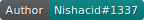
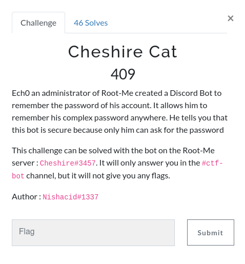
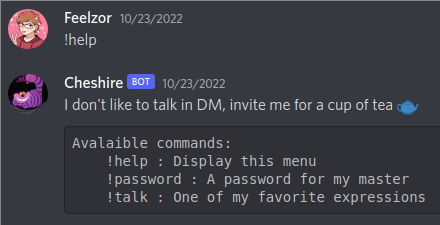
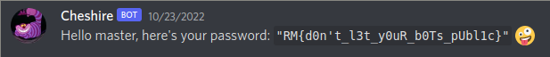

# Cheshire Cat

 

## Discovering the bot

This challenge consists of retrieving secret information from a discord bot, which we can assume from the description is a password.

The bot doesn't like us talking in private with him, but it's not like we really care about that. The description tells us that he will only answer us in the `#ctf-bot` channel, but if it was the case, I could just screen record the channel and wait for someone else to solve the challenge for me. There must be another way.

In DM, the bot doesn't answer to any `!password` command, and will tell us we are not his master when asking for the same thing in the `#ctf-bot` channel.

`!talk` only gives us inspiring quotes, that is not interesting for us (I mean I did spend some time spamming `!talk` but I knew it was pointless).

## Reading answers

When I asked for him to help me, Cheshire has an interesting response: "invite me for a cup of tea", which led to many tries on the `#ctf-bot` that I found very funny.

From `!tea` to `!🫖`, I've seen (and done) many interesting ways to try to break the bot, including:

- Changing my name to Ech0, even after Nishacid explicitely made an announcement that it was not necessary (I'm sorry);

- Spamming `!password` until Cheshire is tired of me and simply gives me the password;

- `!🫖`, `!tea` or `!password @Ech0` (my favorite one, but it bothered the admins and they made an announcement that we didn't have to do it);

- Sending him an invitation link for my private server in DM, he obviously didn't click it.

## Inviting Cheshire for a cup of coffee

A real bot invitation mustn't be taken lightly, you don't just randomly throw them a Discord invite link, that is rude. You must subtly invite them with a kindly crafted invite link. Once you copy Cheshire id (`980846289723994122`), you can invite him over oauth2: `https://discord.com/oauth2/authorize?client_id=980846289723994122&permissions=1133584&scope=bot`.

After that, that's it! Cheshire is on your Discord server. What happens next?

`!password`

**Flag: `RM{d0n't_l3t_y0uR_b0Ts_pUbl1c}`**
