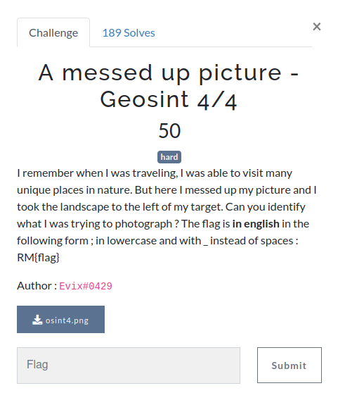
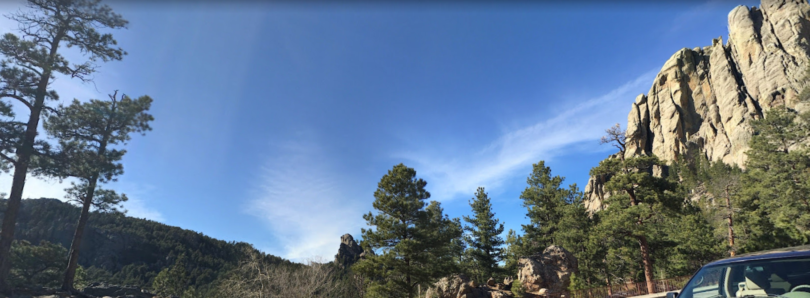
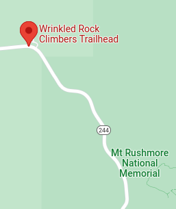

# A messed up picture - Geosint 4/4

  

## The challenge

This image gives us nothing to see, but google reverse gives us useful information. The first visual match is named `wrinkled rock camping`, and when searching for it on google maps and unzooming, here is what we see:

We can check that this is what we want, but it is indeed the mount we are searching for.

**Flag: `RM{mount_rushmore}`**
