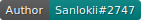
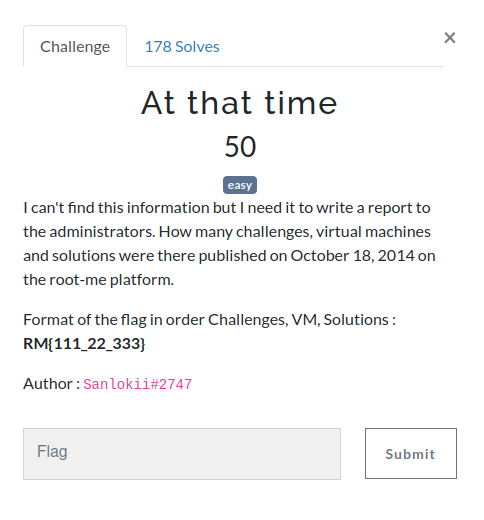
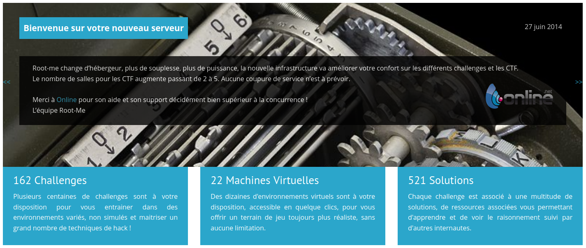

# At that time

  

## Solving the challenge

Simply using the [Wayback Machine](https://web.archive.org/web/20141018192412/http://www.root-me.org/) is enough to solve this challenge, and was my first step when trying to find information about old versions of Root-Me.

**Flag: `RM{162_22_521}`**
