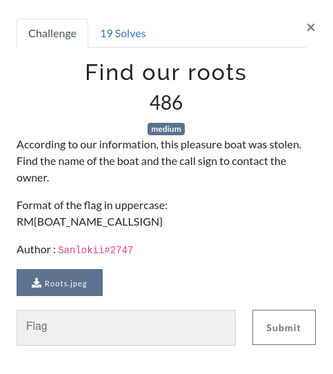
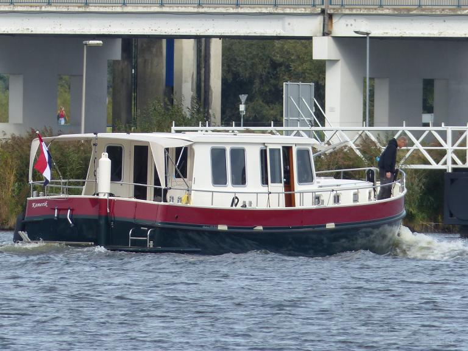
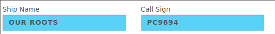

# Find Our Roots

  



## Discovering a new boat



This is the boat that we are supposed to search for. This write-up is mainly a list of what **didn't work** when I tried to find the boat. You can skip to the end of the WU to find out how I solved it, and how I would solve it now.

So as I have done for all the OSINT challenges in this CTF, my first try was to reverse search the image with Google Lenses. Unfortunately, this gives no interesting results. I mainly found that this could be an Aquanaut Dutch Craftsmanship, that other boats existed but none would match this exact ship.

This is bad news, terrible news if I may say so. I know I will struggle finding this boat. When asking google about what is written on the boat, the answer is `Kamenik`, but a little bit of research shows that it probably is `Kamerik` instead (with an r), since this is a city in the Netherlands.

Why the Netherlands? Because I've noticed the flag at the back of the boat, and I'm convinced this is not just a coincidence.

## First search

My first idea is to search for that boat. I've searched for `kamerik boat netherlands` and found nothing interesting. I've been on websites such as [eventbrite](https://www.eventbrite.com/b/netherlands--kamerik/auto-boat-and-air/) and [tripadvisor](https://www.tripadvisor.com/Attraction_Review-g5230957-d8686439-Reviews-Buitenplaats_Kameryck-Kamerik_Woerden.html) but have found nothing. I eventually found other websites in dutch that would seem interesting, but would always end up considering they didn't have this boat specifically.

That is when I decided that because they told us about a stolen boat, I would search about stolen boats. I've ended up on [StolenBoats](https://stolenboats.info/en/home?category=motorboat&needle=), which seems to list lots of stolen boats (how curious). While being sad for the boats' owners, I was particularly happy that this one existed, so I decided to go though all the pages. I've created a little javascript snippet that I could paste in my console to retrieve everything from the website.

```js
function removeNotNetherlands(source) {
  source.querySelectorAll('#search-form-container ~ div.px-10 > div > div > div').forEach((div) => {
    if (div.querySelector('.p-6 .text-sm:last-of-type').textContent.indexOf('Netherlands') === -1) {
        div.remove();
    }
  });
}

async function retrieve(number) {
  let ok = false;
  let pageRes;

  while (!ok) {
    pageRes = await fetch(`https://stolenboats.info/en/home?category=motorboat&needle=&page=${number}`);
    ok = pageRes.ok;
  }

  return pageRes;
} 

async function crawlPage(number) {
  let pageRes = await retrieve(number);
  let htmlText = await pageRes.text();
  let mainDiv = document.createElement('div');
  mainDiv.innerHTML = htmlText;
  removeNotNetherlands(mainDiv);
  document.querySelector('#search-form-container ~ div.px-10 > div > div').innerHTML += mainDiv.querySelector('#search-form-container ~ div.px-10 > div > div').innerHTML;
}

removeNotNetherlands(document);

async function crawlAll() {
  for (let i = 2; i < 363; i++) {
    await crawlPage(i);
  }
}

await crawlAll();
```

This is particularly slow, since everything is made synchronously. But it works and it is enough for me (I do not have to crawl 10k websites, only 363 pages). One could argue that an automated python script would have been a better idea, but I was convinced this would be **THE** solution. God knows I was wrong.

After running the snippet, I had a very long list of stolen boats with their pictures, and hoped the one I was looking for would appear somewhere. I've scrolled endlessly (yup, I did it manually) only to find that my stolen boat wasn't there. Lies and deception.


## Back to our roots (yeah I know I'm funny)

Since I have had no results on that road, I may explore another one: the exifroad, with `exiftool`. The output does contain some interesting information.

```bash
ExifTool Version Number         : 12.42
File Name                       : Roots.jpeg
Directory                       : /home/feelzor/Downloads
File Size                       : 86 kB
File Modification Date/Time     : 2022:10:22 12:36:38+02:00
File Access Date/Time           : 2022:10:23 16:21:40+02:00
File Inode Change Date/Time     : 2022:10:22 12:36:38+02:00
File Permissions                : -rw-r--r--
File Type                       : JPEG
File Type Extension             : jpg
MIME Type                       : image/jpeg
JFIF Version                    : 1.02
Exif Byte Order                 : Big-endian (Motorola, MM)
X Resolution                    : 1
Y Resolution                    : 1
Resolution Unit                 : None
Artist                          : Rene te Pas
Y Cb Cr Positioning             : Centered
Exif Version                    : 0232
Date/Time Original              : None
Components Configuration        : Y, Cb, Cr, -
Flashpix Version                : 0100
Color Space                     : Uncalibrated
Current IPTC Digest             : c26a09f0f7e253874f74ed543c4d4ab7
Coded Character Set             : UTF8
Envelope Record Version         : 4
Date Created                    : 2020:10:02
By-line                         : Rene te Pas
Application Record Version      : 4
XMP Toolkit                     : Image::ExifTool 12.36
Creator                         : Rene te Pas
Image Creator Name              : Rene te Pas
Image Width                     : 768
Image Height                    : 576
Encoding Process                : Baseline DCT, Huffman coding
Bits Per Sample                 : 8
Color Components                : 3
Y Cb Cr Sub Sampling            : YCbCr4:2:0 (2 2)
Image Size                      : 768x576
Megapixels                      : 0.442
```

What I immediately saw was the name of the artist: Rene te Pas. That **must** be it! I didn't even take the time to read the rest of the output (bad idea, if you ask me) and went back on my best googling. `Rene te pas kamerik boat`, `Rene te pas boat`, `Rene te pas netherlands`, `Rene te pas` are all searched I've made, yet this boat is still not appearing, even in the images tab. I've found a LinkedIn page, a Facebook page, but none seemed to be of a photographer passionate about boats. So where did he go?

If I'm completely honest, one result kept my attention. I found the [MarineTraffic](https://www.marinetraffic.com/en/photos/by/page:1/copyright:Rene%20te%20Pas/) page where that person posts lots of pictures of boats. Incredible! I go through the 10 first pages before asking myself: how many are there? That is when I realized there was more than 100 pages, and I couldn't just open all of them by myself.

Is this javascript time? Yes it is!

```js
async function retrieve(number) {
  let ok = false;
  let pageRes;

  while (!ok) {
    pageRes = await fetch(`https://www.marinetraffic.com/en/photos/by/page:${number}/copyright:Rene%20te%20Pas/`);
    ok = pageRes.ok;
  }

  return pageRes;
} 

async function crawlPage(number) {
  let pageRes = await retrieve(number);
  let htmlText = await pageRes.text();
  let mainDiv = document.createElement('div');
  mainDiv.innerHTML = htmlText;
  document.querySelector('#gallery').innerHTML += mainDiv.querySelector('#gallery').innerHTML;
}

async function crawlAll() {
  for (let i = 2; i <= 103; i++) {
    crawlPage(i);
  }
}

await crawlAll();
```

This similar script retrieves all pictures from our beloved Rene Te Pas, this time without the `await` that would make it synchronous, to gain execution time (spoiler: it slowed down the process **a lot**). While the script worked, it was not fast at all (I had to wait more than 30 minutes for it to complete). The generated HTML was a few hundred thousand lines long, that is way too much. My CTRL+F skills were tested by this website, and unfortunately, no boat named `Kamerik`, `Kamenik` or whatever. Does this boat really exists?


## Listing existing boats

During my research about call numbers, I understood it was a way to uniquely identify any boat, so two boats with the same name would not be mistaken for the other. Pretty smart, right? So I searched for a call number database, and found [Ship Station List](https://www.itu.int/mmsapp/ShipStation/list) that seems to be pretty exhaustive. 

I searched for Kamenik, Kamerik, Kamepanik (pas = not in french, and makes a joke with panic), but found nothing. I've searched for K, Ka, Kam and other flavors, even rik, nik. Nothing came up in Netherlands (HOL on the website). Why is the world against me?

This is exactly when I started to doubt that Kamenik, Kamerik or whatever was written on that boat was the boat's name.


## The real solution

At that point, I had no clue what I was searching for, decided that the name I thought was the one of the boat was wrong, and I had searched everywhere. First, I came back to `exiftool`, realizing that there was a date for the photograph (2020-10-02), which would have avoided me the need to make a script for MarineTraffic and saved me around an hour of time. However, this finding revealed nothing to me, as I wasn't able to find the picture, even with the date.

I decided to read the description once again, **and** the title. I asked myself the question "what am I looking for?". At that time, I also read `Find Our Roots`, which is the name of the challenge, and tells a lot about it.

Wait. I'm searching for something, and the challenge asks me to find "Our Roots", isn't it?




Did I really lose 6 hours of this CTF just because I can't read? Yes I did! However, this is not it, not yet. **Our Roots** does not validate, since this is not the exact name of the boat. Another useful website when searching boats that do not exist on Marine Traffic is [Vessel Finder](https://www.vesselfinder.com/). When searching for `Our Roots` on it, we find a dutch ship named `Our Roots II`, that has exactly the same photograph I've been searching for hours. Yay! 🎉

**Flag: `RM{OUR_ROOTS_II_PC9694}`**

## How I would solve the challenge now

I've been thinking about how this challenge blocked me for way too long because I was not doing the search in the right order, and how most of the struggle could've been avoided if I wasn't so narrowsighted during the challenge. After hours of reflexion (which increases the sum of time needed for this challenge to at least 10), I have found ways to reduce the time considerably.

First, read all the results of `exiftool`, **even before** searching for the picture on google. I would have found that Rene Te Pas had taken this picture in October 2020, which is a very valuable information if the challenge name isn't `Find Our Roots`.

After using Google Lenses and finding no results, I would not stay so convinced that the boat is named Kamenik or Kamerik, and would stop searching in that direction **for a moment**, with notes taken about what I discovered.

The next step is to search on relevant websites, first Marine Traffic with the author and the photograph date (and hope that metadata is correct), then Vessel Finder. With these searches, I would've found the ship in less than an hour, instead of a quarter of a day. Who knows, maybe would I have solved other challenges, saved my sanity and had an even better place in the scoreboard?

With time I think I really like this challenge, even if I was really angry at it for hours. I learned a lot about what is wrong when I try to solve OSINT challs, and how I can improve with a little bit of thinking.
