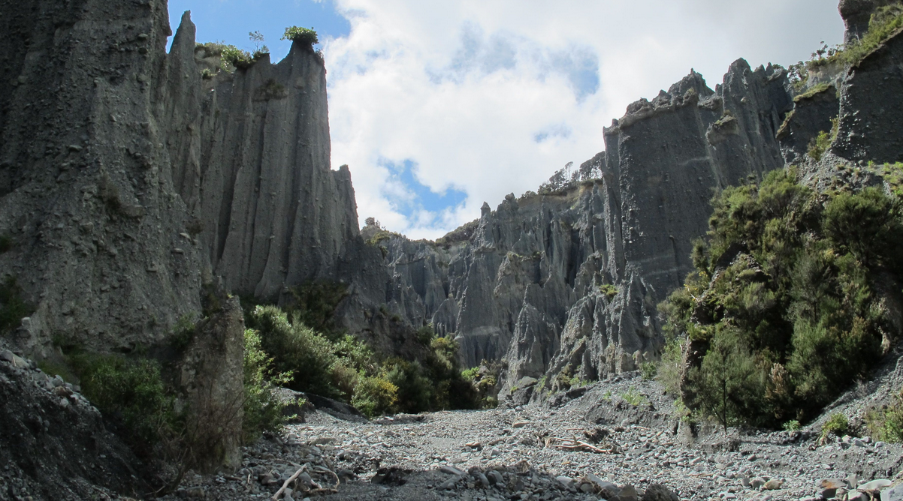

# Watch some movies ? - Geosint 2/4

  

## The challenge

Searching with Google Lenses, we find that this is the Putangirua Pinnacles. With another Google search (`Putangirua Pinnacles movie`), I found a [website](https://www.filmquest.co/film-locations/putangirua-pinnacles-the-dimholt-road/) that told me that LOTR - The Return of the King is the famous movie that has been recorded here.

**Flag: `RM{the_return_of_the_king}`**
