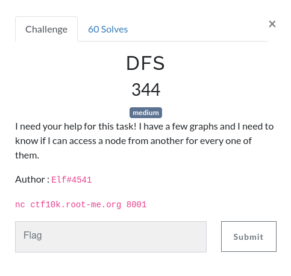

# DFS

  



## What is DFS and what is this challenge?

DFS stands for Depth-First Search, and is common in graph theory and algorithms. The idea is that when you have a node with children, you go to the first child, see if it has children, go through the first, etc. When you have finished exploring your first child, you do the same with the second, then the third...

The gif from the [Wikipedia](https://en.wikipedia.org/wiki/Depth-first_search) page show it clearly:


This challenge is exactly the representation of a directed graph. We have a list of nodes and the list of nodes they are linked to. For example, **node 1** can access 2 and 3, **node 2** has no node it can access, **node 3** can access 2 and 4 and **node 4** can only access 3 (source: [Wikipedia](https://en.wikipedia.org/wiki/Directed_graph)).


The challenge is to see if it is possible to go through node a to node b. In this example, is it possible to go from node 4 to node 2? From node 2 to node 1? The answers are respectively yes and no, but how did we do it?

In the first question, you start at node 4, go to node 3, then node 2 and voilà, you have found your path. In the second, you can access only node 2 from node 2, so you are stuck there, the answer is no. For the sake of this problem, we will consider that going from node a to node a (the same node) is **always** possible, even if not explicitely said.

## Solving the challenge

With this example in mind, we can write an algorithm that will allow us to go from node a to node b.

```ts
nodeEnd is a number
exploredNodes is a boolean[]

function explore -> in nodeNumber
|  if exploredNodes[nodeNumber] == true
|  |  skip // We skip nodes that are already explored
|
|  if nodeNumber == nodeEnd
|  |  return true
|
|  exploredNodes[nodeNumber] = true // We mark the node as explored
|
|  for each node child of nodeNumber
|  |  if explore(node)
|  |  |  return true // We have found a path to nodeEnd from this node
|
|  return false // We have found no path from this node to nodeEnd
```

This is an example implementation of the Depth-First Search, since we `explore` before seeing if we have other child nodes.

In my implementation, I have created an array `nodeEdges` that contains, for each node, an array of reachable nodes. For the example above, the `nodeEdges` would look like that:

```json
[
  [2, 3], // Node 1
  [],     // Node 2
  [2, 4], // Node 3
  [3]     // Node 4
]
```

With this representation in mind, we also have another array that I called `nodes`, that keeps the state of nodes to see if they have been visited or not. In the same example, it would look like this array at the beginning.

```json
[false, false, false, false]
```

With only these two arrays, we can create our recursive function that gives us the answer yes/no.

```python
def findPath(node, toNode, nodeEdges):
    if node == []: # This node has no children
        return False

    if toNode in node: # The destination is a child of the current node
        return True

    for dest in node: # Loop through children
        if nodes[dest]:
            continue # Node already visited

        nodes[dest] = True
        if findPath(nodeEdges[dest], toNode, nodeEdges): # Recursive call
            return True
```

When we connect with netcat to the challenge, we are greeted with this message.

```
Hello there! I need some help for my homework, pleeeease.
[1/60] Here's my graph's adjacency list, can you tell me if I can reach node 0 from 0 please? (yes / no)
Node 0 has a directed edge to : 4, 5
Node 1 has a directed edge to : 12, 14
Node 2 has no directed edge
Node 3 has a directed edge to : 0, 2, 9, 10
Node 4 has a directed edge to : 5, 16
Node 5 has a directed edge to : 0, 1, 12
Node 6 has a directed edge to : 7, 8
Node 7 has a directed edge to : 2, 12
Node 8 has a directed edge to : 6
Node 9 has a directed edge to : 8
Node 10 has a directed edge to : 13
Node 11 has a directed edge to : 8, 12, 13
Node 12 has a directed edge to : 14
Node 13 has a directed edge to : 7
Node 14 has a directed edge to : 16
Node 15 has a directed edge to : 0, 11
Node 16 has a directed edge to : 6
>
```

We understand that we must answer properly 60 times a question such as this one. If the destination node is the same as the source node (it is the case here), we must answer yes, otherwise we call our recursive function. To connect to Netcat, I used the same solution than for [RPN](./RPN.md).

We know that in the first line is an introduction (and "This is correct" when we send a truthful answer), and the second line is our objective. With a simple regex we can parse the source and the destination numbers.

```python
    request = nc.read(2048) # Read the request
    print(request)
    lines = request.splitlines()
    objective = re.search(r"can you tell me if I can reach node (\d+) from (\d+)", lines[1])
    source_node_nb = int(objective.group(2))
    destination_node_nb = int(objective.group(1))
    if (source_node_nb == destination_node_nb):
        nc.write(bytes('yes\n', 'utf-8'))
        continue
```

We need to prepare our arrays before calling the recursive function. We initialize the edges to an empty array, read every line and create an array of children. `nodes` is initialized to n times `False`, n being the number of nodes. After reading this, it should be `len(lines) - 3`, since the first 2 lines are the introduction and the objective, and the last line is the prompt `>`.

```python
    nodeEdges = []
    for node in lines[2:-1]:
        if node.find('no directed edge') != -1:
            nodeEdges.append([]) # No children
        else:
            edgesList = node[node.find('to : ') + len('to : '):].split(', ') # Read the end of the line, and split between numbers
            nodeEdges.append([int(i) for i in edgesList]) # Convert all strings to integers

    nodes = [ False ] * (len(lines) - 2)
```

We need to mark our source node as visited (to avoid visiting it once again, it wouldn't be too much of a problem but it's a waste of time and resources), and call our solve function.

```python
nodes[source_node_nb] = True
    if (findPath(nodeEdges[source_node_nb], destination_node_nb, nodeEdges)):
        print('yes')
        nc.write(bytes('yes\n', 'utf-8'))
    else:
        print('no')
        nc.write(bytes('no\n', 'utf-8'))
```

**Flag `RM{34sy_d3pth_f1rst_s3arch}`**

## Problem

While testing my program to make the writeup, I realized I've been lucky to have the flag first try. The `nc.read(2048)` sometimes isn't enough to read the whole request, and the program fails. This would be easily fixed with `nc.read(4096)` or other sizes that allow for more space that this one does (I believe it is the matter of a few hundred bytes that are missing).

## Full solution

```python
#!/bin/env python3

import socket
import re

class Netcat:

    """ Python 'netcat like' module """

    def __init__(self, ip, port):

        self.buff = ""
        self.socket = socket.socket(socket.AF_INET, socket.SOCK_STREAM)
        self.socket.connect((ip, port))

    def read(self, length = 1024):

        """ Read 1024 bytes off the socket """

        data = self.socket.recv(length).decode('utf-8')

        return data

    def read_until(self, data):

        """ Read data into the buffer until we have data """

        while not data in self.buff:
            self.buff += self.socket.recv(1024).decode('utf-8')

        pos = self.buff.find(data)
        rval = self.buff[:pos + len(data)]
        self.buff = self.buff[pos + len(data):]

        return rval

    def write(self, data):

        self.socket.send(data)

    def close(self):

        self.socket.close()

nc = Netcat('ctf10k.root-me.org', 8001)

nodes = []

def findPath(node, toNode, nodeEdges):
    if node == []:
        return False

    if toNode in node:
        return True

    for dest in node:
        if nodes[dest]:
            continue

        nodes[dest] = True
        if findPath(nodeEdges[dest], toNode, nodeEdges):
            return True

for j in range(60):
    request = nc.read(2048)
    print(request)
    lines = request.splitlines()
    objective = re.search(r"can you tell me if I can reach node (\d+) from (\d+)", lines[1])
    source_node_nb = int(objective.group(2))
    destination_node_nb = int(objective.group(1))
    if (source_node_nb == destination_node_nb):
        nc.write(bytes('yes\n', 'utf-8'))
        continue

    nodeEdges = []
    for node in lines[2:-1]:
        if node.find('no directed edge') != -1:
            nodeEdges.append([])
        else:
            edgesList = node[node.find('to : ') + len('to : '):].split(', ')
            nodeEdges.append([int(i) for i in edgesList])

    nodes = [ False ] * (len(lines) - 2)

    nodes[source_node_nb] = True
    if (findPath(nodeEdges[source_node_nb], destination_node_nb, nodeEdges)):
        print('yes')
        nc.write(bytes('yes\n', 'utf-8'))
    else:
        print('no')
        nc.write(bytes('no\n', 'utf-8'))

request = nc.read(2048)
print(request)
```
