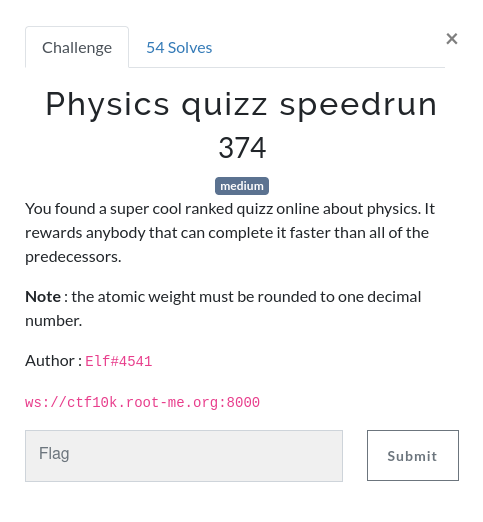

# Physics Quizz Speedrun

  



## Solving the problem

When we connect to the websocket, we receive the following sequence:

```
010110010110111100101100001000000111000001101100011001010110000101110011011001010010000001110100011001010110110001101100001000000110110101100101001000000111011101101000011000010111010000100000011010010111001100100000011101000110100001100101001000000111011001100001011011000111010101100101001000000110111101100110001000000111010001101000011001010010000001100001011101000110111101101101011010010110001100100000011101110110010101101001011001110110100001110100001000000110011001101111011100100010000001110100011010000110010100100000010100000110000101101100011011000110000101100100011010010111010101101101
```

Which means `Yo, please tell me what is the value of the atomic weight for the Palladium`.

The first step is to decode the binary so that our program can understand what happens.

```python
from websocket import create_connection

def binStrToAscii(string):
    n = 8
    splittedReq = [string[i:i+n] for i in range(0, len(string), n)]
    return ''.join(chr(int(val, 2)) for val in splittedReq)

ws = create_connection("ws://ctf10k.root-me.org:8000")

binaryReq = ws.recv()
request = binStrToAscii(binaryReq)
print(request)
```

This works properly! Now what are we asked to do?

With a little analysis, there are three different tasks that can take two forms every time:

- Atomic Weight of an atom

- CAS Number of an atom

- Number of electrons of an atom

When asking these questions, the are two ways the question is asked:

- ... {task} ... {atomName} please?

- ... {task} ... {atomName}?

Where `{task}` is either `atomic weight`, `cas number` or `number of electrons`.

## Finding resources

To retrieve all the necessary information, I need resources (I am no chemist and are definitely too lazy to observe all atoms). I've found two websites that gave me the 3 elements I was looking for. These were [Britannica](https://www.britannica.com/science/atomic-weight) and [Periodic Table](https://periodictable.com/Properties/A/CASNumber.html) that I copied in a google sheet document, and used it in [CSV To JSON Converter](https://www.convertcsv.com/csv-to-json.htm).

My json looks like an array of these objects:

```json
 {
   "cas": "CAS7440-67-7",
   "element": "zirconium",
   "symbol": "Zr",
   "number": 40,
   "weight": "91.224"
 }
```

This JSON will be named `elements`, and parsed into a `dict` named `atomDict` that will associate the element name with its JSON object. Since the weight may be either a number or a range `[a, b]`, we need a specific handler for the weight. I used the mean, and adapted some results when I realized it failed the program.

```python
atomDict = dict()

for element in elements:
    elementName = element['element'].strip() # Trim the name
    weightString = element['weight']
    if weightString[0] == '[':
        weightTable = weightString[1:-1].split(', ')
        weightNumber = (float(weightTable[0]) + float(weightTable[1])) / 2
    else:
        weightNumber = float(element['weight'])

    atomDict[elementName] = {
        "weight": round(weightNumber, 1),
        "electrons": element['number'],
        "cas": element['cas']
    }
```

## Finishing the solution

With our atom dictionary ready to be used, we can parse our objective and find the answer.

```python
    objective = re.search(r"(\w+)( please\?)?$", request)
    searchedElement = objective.group(1).lower()

    if (request.find('atomic weight') != -1):
        answer = atomDict[searchedElement]['weight']
    if (request.find('cas number') != -1):
        answer = atomDict[searchedElement]['cas'][3:]
    if (request.find('number of electrons') != -1):
        answer = atomDict[searchedElement]['electrons']
```

If we send the answer directly, the robot does not understand what we mean, so we have to transform it in binary.

```python
binAnswer = str(''.join(format(ord(x), 'b').zfill(8) for x in str(answer)))
print(binAnswer)
```

When looping that and ignoring messages that do not concern us, we find the solution after a few program runs.

**Flag: `RM{4t0ms_sp33drunn3r_sp3c14l1st}`**

## Problems

The sources I've used to retrieve information about atoms were not always up to date and had sometimes older names for the last atoms. Using the mean of the range for the atoms weight seemed to work, but I have sometimes had to correct some values manually with a google search.

While the dataset is not perfect, it works in the majority of cases, and let me retrieve the flag. I didn't need more than that, but it could be improved.

## Full solution

```python
#!/bin/env python3

elements = [
 {
   "cas": "CAS1333-74-0",
   "element": "hydrogen",
   "symbol": "H",
   "number": 1,
   "weight": "[1.00784, 1.00811]"
 },
 {
   "cas": "CAS7440-59-7",
   "element": "helium",
   "symbol": "He",
   "number": 2,
   "weight": "4.002602"
 },
 {
   "cas": "CAS7439-93-2",
   "element": "lithium",
   "symbol": "Li",
   "number": 3,
   "weight": "[6.938, 6.997]"
 },
 {
   "cas": "CAS7440-41-7",
   "element": "beryllium",
   "symbol": "Be",
   "number": 4,
   "weight": "9.0121831"
 },
 {
   "cas": "CAS7440-42-8",
   "element": "boron",
   "symbol": "B",
   "number": 5,
   "weight": "[10.806, 10.821]"
 },
 {
   "cas": "CAS7440-44-0",
   "element": "carbon",
   "symbol": "C",
   "number": 6,
   "weight": "[12.0096, 12.0116]"
 },
 {
   "cas": "CAS7727-37-9",
   "element": "nitrogen",
   "symbol": "N",
   "number": 7,
   "weight": "[14.00643, 14.00728]"
 },
 {
   "cas": "CAS7782-44-7",
   "element": "oxygen",
   "symbol": "O",
   "number": 8,
   "weight": "[15.99903, 15.99977]"
 },
 {
   "cas": "CAS7782-41-4",
   "element": "fluorine",
   "symbol": "F",
   "number": 9,
   "weight": "18.998403163"
 },
 {
   "cas": "CAS7440-01-9",
   "element": "neon",
   "symbol": "Ne",
   "number": 10,
   "weight": "20.1797"
 },
 {
   "cas": "CAS7440-23-5",
   "element": "sodium",
   "symbol": "Na",
   "number": 11,
   "weight": "22.98976928"
 },
 {
   "cas": "CAS7439-95-4",
   "element": "magnesium",
   "symbol": "Mg",
   "number": 12,
   "weight": "[24.304, 24.307]"
 },
 {
   "cas": "CAS7429-90-5",
   "element": "aluminum",
   "symbol": "Al",
   "number": 13,
   "weight": "26.9815385"
 },
 {
   "cas": "CAS7440-21-3",
   "element": "silicon",
   "symbol": "Si",
   "number": 14,
   "weight": "[28.084, 28.086]"
 },
 {
   "cas": "CAS7723-14-0",
   "element": "phosphorus",
   "symbol": "P",
   "number": 15,
   "weight": "30.973761998"
 },
 {
   "cas": "CAS7704-34-9",
   "element": "sulfur",
   "symbol": "S",
   "number": 16,
   "weight": "[32.059, 32.076]"
 },
 {
   "cas": "CAS7782-50-5",
   "element": "chlorine",
   "symbol": "Cl",
   "number": 17,
   "weight": "[35.446, 35.457]"
 },
 {
   "cas": "CAS7440-37-1",
   "element": "argon",
   "symbol": "Ar",
   "number": 18,
   "weight": "39.948"
 },
 {
   "cas": "CAS7440-09-7",
   "element": "potassium",
   "symbol": "K",
   "number": 19,
   "weight": "39.0983"
 },
 {
   "cas": "CAS7440-70-2",
   "element": "calcium",
   "symbol": "Ca",
   "number": 20,
   "weight": "40.078"
 },
 {
   "cas": "CAS7440-20-2",
   "element": "scandium",
   "symbol": "Sc",
   "number": 21,
   "weight": "44.955908"
 },
 {
   "cas": "CAS7440-32-6",
   "element": "titanium",
   "symbol": "Ti",
   "number": 22,
   "weight": "47.867"
 },
 {
   "cas": "CAS7440-62-2",
   "element": "vanadium",
   "symbol": "V",
   "number": 23,
   "weight": "50.9415"
 },
 {
   "cas": "CAS7440-47-3",
   "element": "chromium",
   "symbol": "Cr",
   "number": 24,
   "weight": "51.9961"
 },
 {
   "cas": "CAS7439-96-5",
   "element": "manganese",
   "symbol": "Mn",
   "number": 25,
   "weight": "54.938044"
 },
 {
   "cas": "CAS7439-89-6",
   "element": "iron",
   "symbol": "Fe",
   "number": 26,
   "weight": "55.845"
 },
 {
   "cas": "CAS7440-48-4",
   "element": "cobalt",
   "symbol": "Co",
   "number": 27,
   "weight": "58.933194"
 },
 {
   "cas": "CAS7440-02-0",
   "element": "nickel",
   "symbol": "Ni",
   "number": 28,
   "weight": "58.6934"
 },
 {
   "cas": "CAS7440-50-8",
   "element": "copper",
   "symbol": "Cu",
   "number": 29,
   "weight": "63.546"
 },
 {
   "cas": "CAS7440-66-6",
   "element": "zinc",
   "symbol": "Zn",
   "number": 30,
   "weight": "65.38"
 },
 {
   "cas": "CAS7440-55-3",
   "element": "gallium",
   "symbol": "Ga",
   "number": 31,
   "weight": "69.723"
 },
 {
   "cas": "CAS7440-56-4",
   "element": "germanium",
   "symbol": "Ge",
   "number": 32,
   "weight": "72.630"
 },
 {
   "cas": "CAS7440-38-2",
   "element": "arsenic",
   "symbol": "As",
   "number": 33,
   "weight": "74.921595"
 },
 {
   "cas": "CAS7782-49-2",
   "element": "selenium",
   "symbol": "Se",
   "number": 34,
   "weight": "78.971"
 },
 {
   "cas": "CAS7726-95-6",
   "element": "bromine",
   "symbol": "Br",
   "number": 35,
   "weight": "[79.901, 79.907]"
 },
 {
   "cas": "CAS7439-90-9",
   "element": "krypton",
   "symbol": "Kr",
   "number": 36,
   "weight": "83.798"
 },
 {
   "cas": "CAS7440-17-7",
   "element": "rubidium",
   "symbol": "Rb",
   "number": 37,
   "weight": "85.4678"
 },
 {
   "cas": "CAS7440-24-6",
   "element": "strontium",
   "symbol": "Sr",
   "number": 38,
   "weight": "87.62"
 },
 {
   "cas": "CAS7440-65-5",
   "element": "yttrium",
   "symbol": "Y",
   "number": 39,
   "weight": "88.90594"
 },
 {
   "cas": "CAS7440-67-7",
   "element": "zirconium",
   "symbol": "Zr",
   "number": 40,
   "weight": "91.224"
 },
 {
   "cas": "CAS7440-03-1",
   "element": "niobium",
   "symbol": "Nb",
   "number": 41,
   "weight": "92.90637"
 },
 {
   "cas": "CAS7439-98-7",
   "element": "molybdenum",
   "symbol": "Mo",
   "number": 42,
   "weight": "95.95"
 },
 {
   "cas": "CAS7440-26-8",
   "element": "technetium",
   "symbol": "Tc",
   "number": 43,
   "weight": "98"
 },
 {
   "cas": "CAS7440-18-8",
   "element": "ruthenium",
   "symbol": "Ru",
   "number": 44,
   "weight": "101.07"
 },
 {
   "cas": "CAS7440-16-6",
   "element": "rhodium",
   "symbol": "Rh",
   "number": 45,
   "weight": "102.90550"
 },
 {
   "cas": "CAS7440-05-3",
   "element": "palladium",
   "symbol": "Pd",
   "number": 46,
   "weight": "106.42"
 },
 {
   "cas": "CAS7440-22-4",
   "element": "silver",
   "symbol": "Ag",
   "number": 47,
   "weight": "107.8682"
 },
 {
   "cas": "CAS7440-43-9",
   "element": "cadmium",
   "symbol": "Cd",
   "number": 48,
   "weight": "112.414"
 },
 {
   "cas": "CAS7440-74-6",
   "element": "indium",
   "symbol": "In",
   "number": 49,
   "weight": "114.818"
 },
 {
   "cas": "CAS7440-31-5",
   "element": "tin",
   "symbol": "Sn",
   "number": 50,
   "weight": "118.710"
 },
 {
   "cas": "CAS7440-36-0",
   "element": "antimony",
   "symbol": "Sb",
   "number": 51,
   "weight": "121.760"
 },
 {
   "cas": "CAS13494-80-9",
   "element": "tellurium",
   "symbol": "Te",
   "number": 52,
   "weight": "127.60"
 },
 {
   "cas": "CAS7553-56-2",
   "element": "iodine",
   "symbol": "I",
   "number": 53,
   "weight": "126.90447"
 },
 {
   "cas": "CAS7440-63-3",
   "element": "xenon",
   "symbol": "Xe",
   "number": 54,
   "weight": "131.293"
 },
 {
   "cas": "CAS7440-46-2",
   "element": "cesium",
   "symbol": "Cs",
   "number": 55,
   "weight": "132.90545196"
 },
 {
   "cas": "CAS7440-39-3",
   "element": "barium",
   "symbol": "Ba",
   "number": 56,
   "weight": "137.327"
 },
 {
   "cas": "CAS7439-91-0",
   "element": "lanthanum",
   "symbol": "La",
   "number": 57,
   "weight": "138.90547"
 },
 {
   "cas": "CAS7440-45-1",
   "element": "cerium",
   "symbol": "Ce",
   "number": 58,
   "weight": "140.116"
 },
 {
   "cas": "CAS7440-10-0",
   "element": "praseodymium",
   "symbol": "Pr",
   "number": 59,
   "weight": "140.90766"
 },
 {
   "cas": "CAS7440-00-8",
   "element": "neodymium",
   "symbol": "Nd",
   "number": 60,
   "weight": "144.242"
 },
 {
   "cas": "CAS7440-12-2",
   "element": "promethium",
   "symbol": "Pm",
   "number": 61,
   "weight": "145"
 },
 {
   "cas": "CAS7440-19-9",
   "element": "samarium",
   "symbol": "Sm",
   "number": 62,
   "weight": "150.36"
 },
 {
   "cas": "CAS7440-53-1",
   "element": "europium",
   "symbol": "Eu",
   "number": 63,
   "weight": "151.964"
 },
 {
   "cas": "CAS7440-54-2",
   "element": "gadolinium",
   "symbol": "Gd",
   "number": 64,
   "weight": "157.25"
 },
 {
   "cas": "CAS7440-27-9",
   "element": "terbium",
   "symbol": "Tb",
   "number": 65,
   "weight": "158.92535"
 },
 {
   "cas": "CAS7429-91-6",
   "element": "dysprosium",
   "symbol": "Dy",
   "number": 66,
   "weight": "162.500"
 },
 {
   "cas": "CAS7440-60-0",
   "element": "holmium",
   "symbol": "Ho",
   "number": 67,
   "weight": "164.93033"
 },
 {
   "cas": "CAS7440-52-0",
   "element": "erbium",
   "symbol": "Er",
   "number": 68,
   "weight": "167.259"
 },
 {
   "cas": "CAS7440-30-4",
   "element": "thulium",
   "symbol": "Tm",
   "number": 69,
   "weight": "168.93422"
 },
 {
   "cas": "CAS7440-64-4",
   "element": "ytterbium",
   "symbol": "Yb",
   "number": 70,
   "weight": "173.045"
 },
 {
   "cas": "CAS7439-94-3",
   "element": "lutetium",
   "symbol": "Lu",
   "number": 71,
   "weight": "174.9668"
 },
 {
   "cas": "CAS7440-58-6",
   "element": "hafnium",
   "symbol": "Hf",
   "number": 72,
   "weight": "178.49"
 },
 {
   "cas": "CAS7440-25-7",
   "element": "tantalum",
   "symbol": "Ta",
   "number": 73,
   "weight": "180.94788"
 },
 {
   "cas": "CAS7440-33-7",
   "element": "tungsten",
   "symbol": "W",
   "number": 74,
   "weight": "183.84"
 },
 {
   "cas": "CAS7440-15-5",
   "element": "rhenium",
   "symbol": "Re",
   "number": 75,
   "weight": "186.207"
 },
 {
   "cas": "CAS7440-04-2",
   "element": "osmium",
   "symbol": "Os",
   "number": 76,
   "weight": "190.23"
 },
 {
   "cas": "CAS7439-88-5",
   "element": "iridium",
   "symbol": "Ir",
   "number": 77,
   "weight": "192.217"
 },
 {
   "cas": "CAS7440-06-4",
   "element": "platinum",
   "symbol": "Pt",
   "number": 78,
   "weight": "195.084"
 },
 {
   "cas": "CAS7440-57-5",
   "element": "gold",
   "symbol": "Au",
   "number": 79,
   "weight": "196.966569"
 },
 {
   "cas": "CAS7439-97-6",
   "element": "mercury",
   "symbol": "Hg",
   "number": 80,
   "weight": "200.592"
 },
 {
   "cas": "CAS7440-28-0",
   "element": "thallium",
   "symbol": "Tl",
   "number": 81,
   "weight": "[204.382, 204.385]"
 },
 {
   "cas": "CAS7439-92-1",
   "element": "lead",
   "symbol": "Pb",
   "number": 82,
   "weight": "207.2"
 },
 {
   "cas": "CAS7440-69-9",
   "element": "bismuth",
   "symbol": "Bi",
   "number": 83,
   "weight": "208.98040"
 },
 {
   "cas": "CAS7440-08-6",
   "element": "polonium",
   "symbol": "Po",
   "number": 84,
   "weight": "209"
 },
 {
   "cas": "CAS7440-68-8",
   "element": "astatine",
   "symbol": "At",
   "number": 85,
   "weight": "210"
 },
 {
   "cas": "CAS10043-92-2",
   "element": "radon",
   "symbol": "Rn",
   "number": 86,
   "weight": "222"
 },
 {
   "cas": "CAS7440-73-5",
   "element": "francium",
   "symbol": "Fr",
   "number": 87,
   "weight": "223"
 },
 {
   "cas": "CAS7440-14-4",
   "element": "radium",
   "symbol": "Ra",
   "number": 88,
   "weight": "226"
 },
 {
   "cas": "CAS7440-34-8",
   "element": "actinium",
   "symbol": "Ac",
   "number": 89,
   "weight": "227"
 },
 {
   "cas": "CAS7440-29-1",
   "element": "thorium",
   "symbol": "Th",
   "number": 90,
   "weight": "232.0377"
 },
 {
   "cas": "CAS7440-13-3",
   "element": "protactinium",
   "symbol": "Pa",
   "number": 91,
   "weight": "231.03588"
 },
 {
   "cas": "CAS7440-61-1",
   "element": "uranium",
   "symbol": "U",
   "number": 92,
   "weight": "238.02891"
 },
 {
   "cas": "CAS7439-99-8",
   "element": "neptunium",
   "symbol": "Np",
   "number": 93,
   "weight": "237"
 },
 {
   "cas": "CAS7440-07-5",
   "element": "plutonium",
   "symbol": "Pu",
   "number": 94,
   "weight": "244"
 },
 {
   "cas": "CAS7440-35-9",
   "element": "americium",
   "symbol": "Am",
   "number": 95,
   "weight": "243"
 },
 {
   "cas": "CAS7440-51-9",
   "element": "curium",
   "symbol": "Cm",
   "number": 96,
   "weight": "247"
 },
 {
   "cas": "CAS7440-40-6",
   "element": "berkelium",
   "symbol": "Bk",
   "number": 97,
   "weight": "247"
 },
 {
   "cas": "CAS7440-71-3",
   "element": "californium",
   "symbol": "Cf",
   "number": 98,
   "weight": "251"
 },
 {
   "cas": "CAS7429-92-7",
   "element": "einsteinium",
   "symbol": "Es",
   "number": 99,
   "weight": "252"
 },
 {
   "cas": "CAS7440-72-4",
   "element": "fermium",
   "symbol": "Fm",
   "number": 100,
   "weight": "257"
 },
 {
   "cas": "CAS7440-11-1",
   "element": "mendelevium",
   "symbol": "Md",
   "number": 101,
   "weight": "258"
 },
 {
   "cas": "CAS10028-14-5",
   "element": "nobelium",
   "symbol": "No",
   "number": 102,
   "weight": "259"
 },
 {
   "cas": "CAS22537-19-5",
   "element": "lawrencium",
   "symbol": "Lr",
   "number": 103,
   "weight": "262"
 },
 {
   "cas": "CAS53850-36-5",
   "element": "rutherfordium",
   "symbol": "Rf",
   "number": 104,
   "weight": "263"
 },
 {
   "cas": "CAS53850-35-4",
   "element": "dubnium",
   "symbol": "Db",
   "number": 105,
   "weight": "268"
 },
 {
   "cas": "CAS54038-81-2",
   "element": "seaborgium",
   "symbol": "Sg",
   "number": 106,
   "weight": "271"
 },
 {
   "cas": "CAS54037-14-8",
   "element": "bohrium",
   "symbol": "Bh",
   "number": 107,
   "weight": "270"
 },
 {
   "cas": "CAS54037-57-9",
   "element": "hassium",
   "symbol": "Hs",
   "number": 108,
   "weight": "270"
 },
 {
   "cas": "CAS54038-01-6",
   "element": "meitnerium",
   "symbol": "Mt",
   "number": 109,
   "weight": "278"
 },
 {
   "cas": "CAS54083-77-1",
   "element": "darmstadtium",
   "symbol": "Ds",
   "number": 110,
   "weight": "281"
 },
 {
   "cas": "CAS54386-24-2",
   "element": "roentgenium",
   "symbol": "Rg",
   "number": 111,
   "weight": "281"
 },
 {
   "cas": "CAS54084-26-3",
   "element": "copernicium",
   "symbol": "Cn",
   "number": 112,
   "weight": "285"
 },
 {
   "cas": "CAS54084-70-7",
   "element": "nihonium",
   "symbol": "Uut",
   "number": 113,
   "weight": "286"
 },
 {
   "cas": "CAS54085-16-4",
   "element": "flerovium",
   "symbol": "Fl",
   "number": 114,
   "weight": "289"
 },
 {
   "cas": "CAS54085-64-2",
   "element": "moscovium",
   "symbol": "Uup",
   "number": 115,
   "weight": "289"
 },
 {
   "cas": "CAS54100-71-9",
   "element": "livermorium",
   "symbol": "Lv",
   "number": 116,
   "weight": "293"
 },
 {
   "cas": "CAS87658-56-8",
   "element": "tennessine",
   "symbol": "Uus",
   "number": 117,
   "weight": "294"
 },
 {
   "cas": "CAS54144-19-3",
   "element": "oganesson",
   "symbol": "Uuo",
   "number": 118,
   "weight": "294"
 }
]


from websocket import create_connection
import re

atomDict = dict()

for element in elements:
    elementName = element['element'].strip() # Trim the name
    weightString = element['weight']
    if weightString[0] == '[':
        weightTable = weightString[1:-1].split(', ')
        weightNumber = (float(weightTable[0]) + float(weightTable[1])) / 2
    else:
        weightNumber = float(element['weight'])
    
    atomDict[elementName] = {
        "weight": round(weightNumber, 1),
        "electrons": element['number'],
        "cas": element['cas']
    }

def binStrToAscii(string):
    n = 8
    splittedReq = [string[i:i+n] for i in range(0, len(string), n)]
    return ''.join(chr(int(val, 2)) for val in splittedReq)

ws = create_connection("ws://ctf10k.root-me.org:8000")

while True:
    binaryReq = ws.recv()
    request = binStrToAscii(binaryReq)
    print(request)

    objective = re.search(r"(\w+)( please\?)?$", request)
    searchedElement = objective.group(1).lower()

    if (request.find('atomic weight') != -1):
        answer = atomDict[searchedElement]['weight']
    if (request.find('cas number') != -1):
        answer = atomDict[searchedElement]['cas'][3:]
    if (request.find('number of electrons') != -1):
        answer = atomDict[searchedElement]['electrons']
        
    print(answer)
    binAnswer = str(''.join(format(ord(x), 'b').zfill(8) for x in str(answer)))
    print(binAnswer)

    ws.send(binAnswer)
    print(binStrToAscii(ws.recv()))


ws.close() # Yep this is useless since we never leave the loop (only when the program crashes)
```


