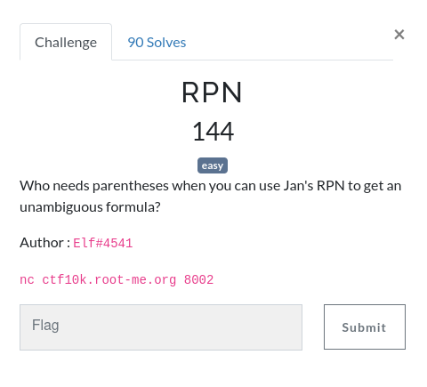

# RPN

  



## What is RPN

To better understand this challenge, we need to understand what RPN is and how to use it. RPN stands for Reverse Polish Notation, and I have first learned it in school, during an algorithm course, for its simplicity of implementation.

This notation is pretty simple, first you specify the values and then the operator, like `3 4 +` which would be the equivalent to `3 + 4`. You can write complex operations without having to worry about the order of operations: `8 4 9 + x` would be `(4 + 9) * 8`.

What happens here is that you read 8, 4 and 9, then you encounter the `+` sign. You take the two operands on the left, and calculate `4 + 9`, which is 13. The resulting calculation is `8 13 x`, which is `8 * 13`, which is `104`.

With that explained this way, the algorithm is easier to understand.

## Creating the program

With this analysis, we can create a pseudo-algorithm like this:

```c
while the calculation is not answered
|  while no operator is encountered
|  |  add operand to stack
|  // This is when our operator is found
|  take b from stack
|  take a from stack // a and b are added in the reverse order
|  add a {op} b to stack
```

The algorithm is pretty short and is not hard to implement. The last challenge is to do this over Netcat. I have stolen a code from [GitHub](https://gist.github.com/leonjza/f35a7252babdf77c8421) to connect to netcat, and modified it when I thought it was necessary.

For example, I've changed the `read` function:

```python
    def read(self, length = 1024):
        """ Read 1024 bytes off the socket """
        data = self.socket.recv(length).decode('utf-8')
        return data
```

Now we need to implement the algorithm in python. The first step is to connect to the netcat from the command line to understand what we receive, how to parse it and how to answer.

```
Can you solve this for me?
31 417 x 689 441 39 878 371 - x 925 x x + x
>
```

The first line is the request, the program wants us to solve this for the person on the other side. The parsing should not be too hard, we just skip first line and parse second line.

```python
nc = Netcat('ctf10k.root-me.org', 8002)

line = nc.read_until('>').splitlines()[-2].split(' ')
```

We read until the `>` character (which is the prompt), and take the second to last line (which is the calculation). We split on every space to get the list of our operands. Now that we have our line, we can create the calculation function.

```python
def calculate(line):
    last_op = [] # Our stack

    for op in line:
        if op == '+':
            last_op.append(last_op.pop() + last_op.pop())
        elif op == '-':
            b = last_op.pop()
            a = last_op.pop()
            last_op.append(a - b)
        elif op == 'x':
            last_op.append(last_op.pop() * last_op.pop())
        else:
            last_op.append(int(op)) # Add the number to the stack

    return last_op[0]
```

Since addition and multiplication are commutative, we do not need to care about which number we pop from the stack first. For subtraction however, this is not the case and we must retrieve b before retrieving a.

When sending the correct answer, the bot responds "And this" with another test. We can loop until we have solved the challenge.

```python
line = nc.read_until('>').splitlines()[-2].split(' ')
nc.write(bytes(str(calculate(line)) + '\n', 'utf-8'))

response = nc.read()
while response.find('And this') != -1:
    print(response)
    line = response.splitlines()[-2].split(' ')
    nc.write(bytes(str(calculate(line)) + '\n', 'utf-8'))
    response = nc.read()
```

At the end, we just print the result and find the flag.

**Flag: `RM{Luk4s13w1cz_w0uld_b3_pr0ud}`**

## Full solution

```python
#!/bin/env python3

# Format : 333 814 81 566 418 x 9 - - + 963 + x 233 709 - 911 - 445 + 188 322 701 526 5 271 x + x + - x +

import socket

class Netcat:

    """ Python 'netcat like' module """

    def __init__(self, ip, port):

        self.buff = ""
        self.socket = socket.socket(socket.AF_INET, socket.SOCK_STREAM)
        self.socket.connect((ip, port))

    def read(self, length = 1024):

        """ Read 1024 bytes off the socket """

        data = self.socket.recv(length).decode('utf-8')

        return data

    def read_until(self, data):

        """ Read data into the buffer until we have data """

        while not data in self.buff:
            self.buff += self.socket.recv(1024).decode('utf-8')

        pos = self.buff.find(data)
        rval = self.buff[:pos + len(data)]
        self.buff = self.buff[pos + len(data):]

        return rval

    def write(self, data):

        self.socket.send(data)

    def close(self):

        self.socket.close()

nc = Netcat('ctf10k.root-me.org', 8002)


def calculate(line):
    last_op = []

    for op in line:
        if op == '+':
            last_op.append(last_op.pop() + last_op.pop())
        elif op == '-':
            b = last_op.pop()
            a = last_op.pop()
            last_op.append(a - b)
        elif op == 'x':
            last_op.append(last_op.pop() * last_op.pop())
        else:
            last_op.append(int(op))

    return last_op[0]


line = nc.read_until('>').splitlines()[-2].split(' ')
nc.write(bytes(str(calculate(line)) + '\n', 'utf-8'))

response = nc.read()
while response.find('And this') != -1:
    print(response)
    line = response.splitlines()[-2].split(' ')
    nc.write(bytes(str(calculate(line)) + '\n', 'utf-8'))
    response = nc.read()

print(response)
```
