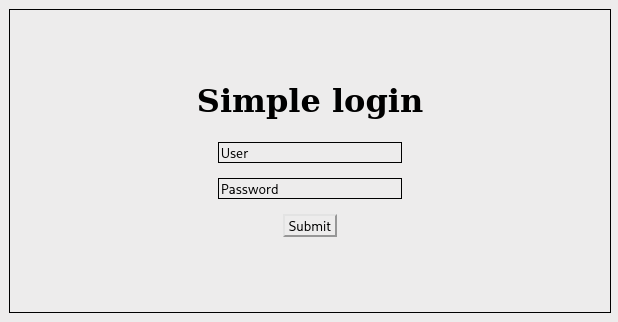

# Simple Login

  


## Welcome!

To start the challenge, I've downloaded the files and decided to go straight to destroying the server (and it didn't work). So we start up on this little piece of page:



Very welcoming, `admin:admin` doesn't work and `' OR 1=1; --` fails as expected. Great! This website has no vulnerabilities. Thank you bye bye! Or maybe it has?

## Inspecting the files given to us

The website owner has full confidence in their code that they even gave it to us. Why not use it then? There is a little `Dockerfile` that starts the webserver with a MySQL service, `app.js` and other files that do not interest us.

I tweaked the `Dockerfile` a little to copy my `my.cnf` that has these added lines:

```tsconfig
[mysqld]
general_log_file        = /var/log/mysql/mysql.log
general_log             = 1
```

This will help us understand what happens on the server side, with MySQL logging our requests (well, most of them).

The whole code that interests us is in the `/auth` route. Let's inspect it.

```js
app.post('/auth', function (req, res) {
    if (!req.is('application/json')) {
        res.send('Data must be send in JSON!', 400);

    } else {
        var credentials = req.body;

        if (typeof credentials.user === "object") {
            res.send("Attack detected!", 400);
        } else if (typeof credentials.password === "object") {
            res.send("Attack detected!", 400);

        } else {
            credentials = Object.assign({"flag": "RM{fake-flag}"}, credentials)

            var sql = "SELECT ? AS FLAG FROM users WHERE user = ? AND password = ?";
            connection.query(
                sql,
                [credentials.flag, credentials.user, credentials.password],
                (e, result, fields) => {
                    if (result.length > 0) {
                        res.send(result[0]["FLAG"], 200);
                    } else {
                        res.send("Invalid credentials!");
                    }
                }
            );
        }
    }
});
```

So we have to send `application/json` content, with `user` and `password` that **cannot** be of type `object` (an array returns `object` when asked with `typeof`). However, they are not required, and they can be safely ignored (MySQL will set `NULL` appropriately).

Our SQL query is not prepared but uses the `?` notation, which is a little bit different from prepared requests, as per [the spec](https://www.npmjs.com/package/mysql#escaping-query-values). For our use case, it makes no difference so let's assume the request is prepared.

In the `package.json` file, we can see that the version used is `"mysql": "^2.18.1"`, the latest at the time of the CTF.

The last part that kept my attention is the `Object.assign` part, where `credentials` is applied to `{"flag": "RM{fake-flag}"}`. That must mean we can override `flag` with our value. Let's see what happens.

## Exploiting the flag override

I've tried injecting SQL code in the flag value, but the escaping works properly.

```json
{"flag": ["'user AS FLAG FROM users; --"]}
```

Gives us the following SQL request:

```sql
SELECT '\' user AS FLAG FROM users; --' AS FLAG FROM users WHERE user = NULL AND password = NULL
```

Our quote is properly escaped. Too bad! So I've read the spec in hopes I could find another way to exploit the vulnerability. If I can leak the `username` and `password` through `FLAG`, I can then connect.

There are three points that are important for us:

1. Strings are safely escaped

2. Objects are turned into `key = 'val'` pairs for each enumerable property on
   the object. If the property's value is a function, it is skipped; if the
   property's value is an object, toString() is called on it and the returned
   value is used.

3. Objects that have a `toSqlString` method will have `.toSqlString()` called
   and the returned value is used as the raw SQL

Point 1 tells us that we cannot exploit this finding through a simple string. Point 3 tells us that having a wonderful `toSqlString` method would fix all our problems. Point 2 is unclear as to what is done to the `key`. Maybe written as is?

Unfortunately, point 3 is impossible as JSON cannot store functions, so we'll try to exploit point 2.

```json
{"flag": {"user AS FLAG FROM users; --": "nothing"}}
```

This payload would, in my head, write the key as is and exploit an SQLi. Unfortunately I was mistaken.

```sql
SELECT `user AS FLAG FROM users; --` = 'nothing' AS FLAG FROM users WHERE user = NULL AND password = NULL
```

Maybe with a backtick?

```sql
SELECT `user`` AS FLAG FROM users; --` = '' AS FLAG FROM users WHERE user = NULL AND password = NULL
```

Nope. I think this is the wrong way. What else do we have in our code?

## The `Object.assign` way

I was convinced that `Object.assign` was weird and could lead to problems. I've searched for `Object.assign side-effects`, `exploiting Object.assign` and finally found [this issue](https://github.com/microsoft/TypeScript/issues/33934) on TypeScript GitHub that reminded me of what I had forgotten: prototype pollution.

Now it was clear, the solution was easy. As I had read before this [Medium post](https://flattsecurity.medium.com/finding-an-unseen-sql-injection-by-bypassing-escape-functions-in-mysqljs-mysql-90b27f6542b4) about SQLi with the `mysql` package and its weird escape mechanism, I knew how to exploit prototype pollution.

By sending `password: { password: 1 }`, MySQL would create ``password = `password` = 1`` in the request, effectively comparing `password` with `password`, then `true` with `1`.

So let's just exploit that fact with prototype pollution, and it'll be a win!

```json
{"__proto__":{ "user":{"user": 1}, "password":{"password":1}}}
```

Well done, we're connected!


**Flag: `RM{Pr0t0_P01s0n1ng+ObJ3cT_SQL1_GOES_BRRRRRRRRRRRRR}`**
